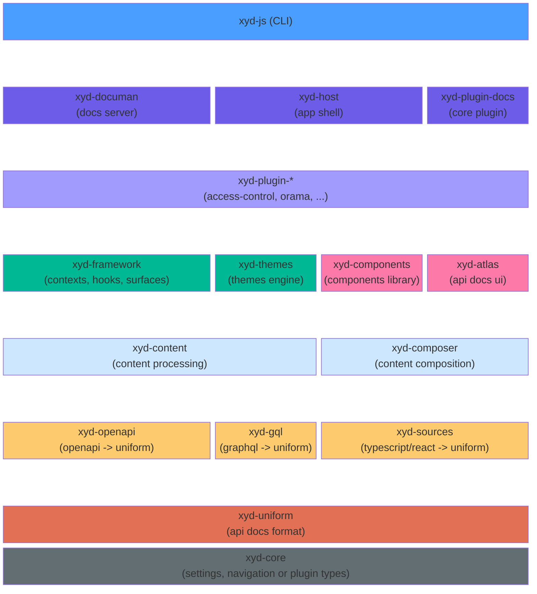
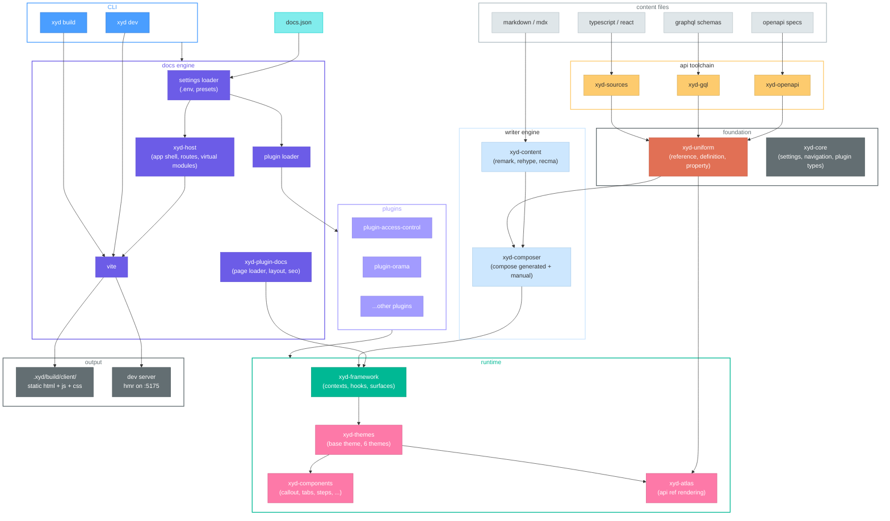

# Getting Started

Get to know a high-level of how xyd works under the hood. 
It covers the repository structure, core capabilities, and major architectural principles.

## Architecture

### Core layers

#### CLI

| Package | Description |
|---|---|
| **xyd-js** | CLI entry point — `xyd dev` starts dev server, `xyd build` produces static site |

#### Docs engine

| Package             | Description |
|---------------------|---|
| **xyd-documan**     | Docs server — loads settings and .env files, resolves and loads plugins, orchestrates Vite dev server and build |
| **xyd-host**        | App shell — React Router routes, client/server entry points, virtual modules, pre-hydration scripts |
| **xyd-plugin-docs** | Core plugin — page loader, layout rendering, SEO meta tags, MDX compilation, edit links |

#### Plugins

| Package | Description |
|---|---|
| **xyd-plugin-*** | Extensible plugins — core docs rendering, access control, search, diagrams, and custom plugins |

#### Runtime

| Package | Description |
|---|---|
| **xyd-framework** | React runtime — contexts, hooks (`useSettings`, `useMetadata`, etc.), surfaces for UI injection |
| **xyd-themes** | Theme engine — `BaseTheme` class, 6 built-in themes (solar, poetry, cosmo, picasso, opener, gusto) |
| **xyd-components** | Components library — Callout, Tabs, Steps, CodeSample, Badge, Card |
| **xyd-atlas** | API reference UI — `ApiRefItem`, `ApiRefProperties`, design tokens, variant selection |

#### Writer engine

| Package | Description |
|---|---|
| **xyd-content** | MDX compilation pipeline — remark, rehype, recma |
| **xyd-composer** | Content composition — combines generated API docs with manually written content |

#### API toolchain

| Package | Description |
|---|---|
| **xyd-openapi** | OpenAPI converter — transforms OpenAPI 3.x specs into Uniform references |
| **xyd-gql** | GraphQL converter — transforms GraphQL schemas into Uniform references |
| **xyd-sources** | TypeScript converter — transforms TypeScript/React sources into Uniform references via TypeDoc |

#### Foundation

| Package | Description |
|---|---|
| **xyd-uniform** | Normalized API docs format — `Reference`, `Definition`, `DefinitionProperty` |
| **xyd-core** | Foundation types — `Settings`, `Navigation`, `Plugin`, `Metadata` |

### System overview

## Community and Resources

- **User Documentation:** https://xyd.dev/docs
- **Starter Template:** https://github.com/xyd-js/starter
- **Examples:** https://github.com/xyd-js/examples
- **Deploy Samples:** https://github.com/xyd-js/deploy-samples
- **API Demo:** https://apidocs-demo.xyd.dev/
- **Component Storybook:** https://components.xyd.dev
- **Slack Community:** https://xyd-docs.slack.com
- **GitHub discussions and issues:** https://github.com/livesession/xyd/discussions and https://github.com/livesession/xyd/issues
