# Core Concepts

This page explains the core concepts of xyd — what each part does and how they connect.

## Settings

The `Settings` interface (from `xyd-core`) is the root configuration object loaded from `docs.json` in the project root. It controls every aspect of a documentation site.

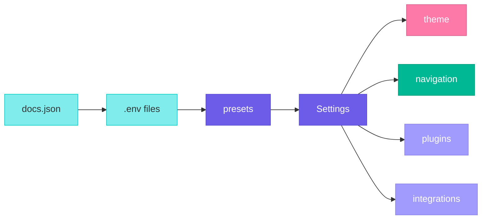

Key sections:

| Section | Purpose |
|---|---|
| `theme` | Visual appearance — theme name, colors, fonts, icons, appearance |
| `navigation` | Site structure — sidebar, tabs, segments, anchors |
| `api` | API documentation sources — OpenAPI, GraphQL specs |
| `plugins` | Plugin array — extends functionality |
| `integrations` | Third-party services — analytics, search, support, diagrams |
| `accessControl` | Page protection — JWT/OAuth authentication |
| `seo` | Search engine optimization — domain, metadata |
| `ai` | AI features — llms.txt generation |
| `advanced` | Low-level config — basename, custom Vite config |

Settings support environment variable substitution using `$VAR_NAME` syntax. Variables are loaded from `.env` files in priority order (`.env` < `.env.local` < `.env.development` < `.env.production`).

Configuration files can be JSON (`docs.json`) or TypeScript (`docs.ts` / `docs.tsx`) for type safety and dynamic logic.

## CLI

The `xyd` command (from the `xyd-js` npm package) is the entry point for all xyd operations:

| Command | What it does |
|---|---|
| `xyd` or `xyd dev` | Starts Vite dev server with HMR, file watching, live preview |
| `xyd build` | Produces static site in `.xyd/build/client/` |

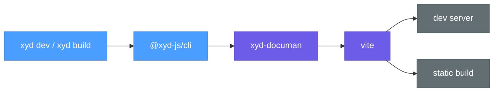

## Documan

The docs server orchestrator:

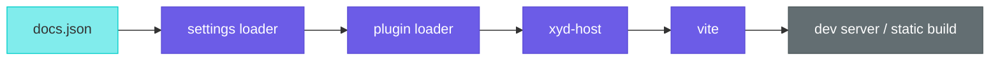

Responsibilities:
- Loads and processes settings from `docs.json` (environment variables, presets, defaults)
- Resolves and loads plugins (npm packages and local plugins)
- Collects plugin contributions (vite plugins, components, markdown plugins, hooks)
- Sets up `xyd-host` with virtual modules
- Orchestrates Vite for dev server and production build
- Watches files for changes (markdown, settings, API specs, .env files)

## Host

The app shell (`xyd-host`) is the Vite + React Router application that boots at runtime. It does **not** define virtual modules — those are created by `xyd-documan` and `xyd-plugin-docs`. Host only **imports** them.

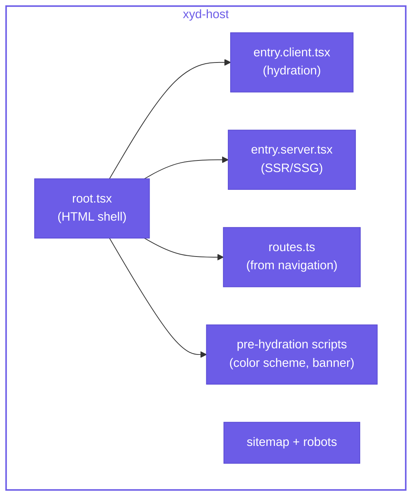

Responsibilities:
- Runs React Router — generates routes from navigation config, handles client-side navigation
- Provides client and server entry points — `entry.client.tsx` hydrates the pre-rendered HTML, `entry.server.tsx` renders pages for SSG
- Executes pre-hydration scripts — synchronous `<head>` scripts that run before React to set color scheme, calculate banner height, and apply feature flags (prevents visual flash)
- Generates SEO outputs — `sitemap.ts` and `robots.ts` for search engine indexing
- Sets up the HTML shell — `root.tsx` imports virtual modules, injects head elements, and wraps the app in the root layout

## Plugins and Integrations

Plugins extend xyd without modifying core code. Each plugin is a factory function that receives settings and returns a `PluginConfig`:

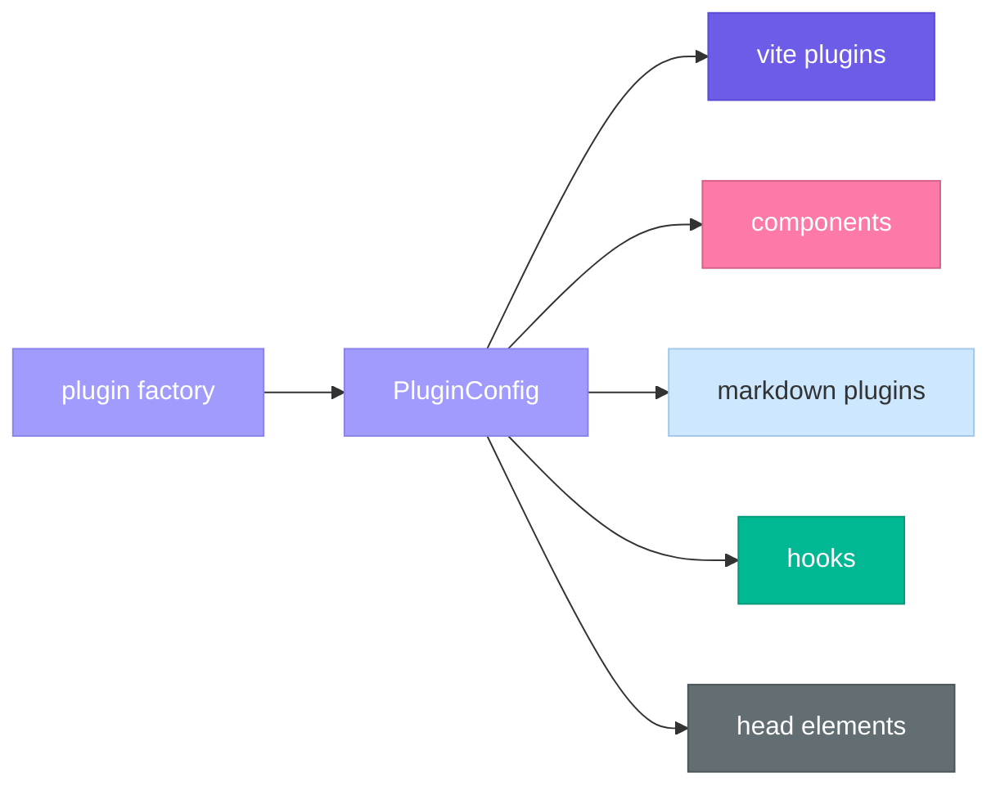

A plugin can contribute:

| Contribution | Purpose |
|---|---|
| `vite` | Build-time Vite plugins |
| `components` | React components available in MDX |
| `markdown.remark` | Remark plugins (markdown AST) |
| `markdown.rehype` | Rehype plugins (HTML AST) |
| `hooks.applyComponents` | Conditionally apply components per page |
| `head` | HTML `<head>` elements (scripts, meta tags) |

**Integrations** are a shorthand — `integrations.analytics`, `integrations.search`, etc. in settings are automatically converted to plugins internally via `integrationsToPlugins()`.

## Framework

The React runtime (`xyd-framework`) provides the context system and hooks that themes and plugins use to access data.

```mermaid
graph LR
    subgraph FrameworkContext["FrameworkContext (app-wide)"]
        S["settings"]
        SG["sidebar groups"]
        M["metadata"]
        CO["components"]
    end

    subgraph FrameworkPageContext["FrameworkPageContext (per page)"]
        CC["content component"]
        TOC["table of contents"]
        BC["breadcrumbs"]
        NL["nav links"]
        EL["edit link"]
    end

    FrameworkContext --> FrameworkPageContext

    style FrameworkContext fill:none,stroke:#00b894,stroke-width:2px,color:#00b894
    style FrameworkPageContext fill:none,stroke:#00b894,stroke-width:2px,color:#00b894
    style S fill:#00b894,color:#fff,stroke:#009a7a
    style SG fill:#00b894,color:#fff,stroke:#009a7a
    style M fill:#00b894,color:#fff,stroke:#009a7a
    style CO fill:#00b894,color:#fff,stroke:#009a7a
    style CC fill:#00b894,color:#fff,stroke:#009a7a
    style TOC fill:#00b894,color:#fff,stroke:#009a7a
    style BC fill:#00b894,color:#fff,stroke:#009a7a
    style NL fill:#00b894,color:#fff,stroke:#009a7a
    style EL fill:#00b894,color:#fff,stroke:#009a7a
```

Two-tier context system:
- **FrameworkContext** wraps the entire app — provides settings, sidebar groups, metadata, component overrides
- **FrameworkPageContext** wraps each page — provides compiled MDX content, TOC, breadcrumbs, prev/next links, edit link

Key hooks:

| Hook | Context | Returns |
|---|---|---|
| `useSettings()` | App | Complete site configuration |
| `useMetadata()` | App | Current page metadata |
| `useAppearance()` | App | Theme appearance settings |
| `useContentComponent()` | Page | Compiled MDX component |
| `useToC()` | Page | Table of contents |
| `useBreadcrumbs()` | Page | Breadcrumb path |
| `useNavLinks()` | Page | Previous/next links |
| `useEditLink()` | Page | GitHub edit URL |

The framework also provides pre-built components (`FwSidebar`, `FwNav`, `FwToc`, `FwBreadcrumbs`, etc.) that themes compose into layouts.

## Themes

Themes control the visual appearance by extending the `BaseTheme` class. Each theme provides `Layout` and `Page` methods that return React components.

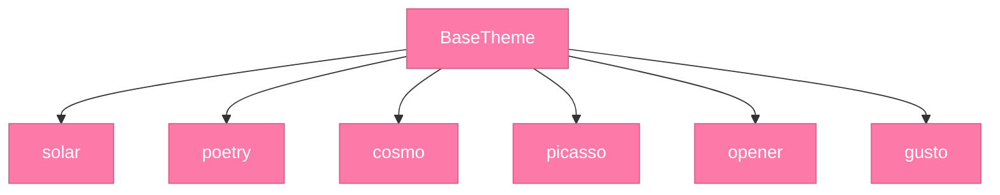

A theme defines:

| Method | Purpose |
|---|---|
| `Layout` | Root structure — navbar, sidebar, footer |
| `Page` | Content area — main content, TOC, breadcrumbs, nav links |
| `Navbar` | Top navigation bar |
| `Sidebar` | Left sidebar with navigation tree |
| `Content` | Main content rendering |
| `ContentNav` | Right sidebar with TOC |
| `Footer` | Site-wide footer |

Themes are configured via `theme.name` in settings. Customization through `theme.appearance` (colors, color scheme, fonts, CSS tokens) without creating a custom theme.

The design token system uses CSS custom properties organized into layers: `reset < defaults < components < themes < user < overrides`.

## Navigation

Navigation is configured through `navigation` in settings and supports five types:

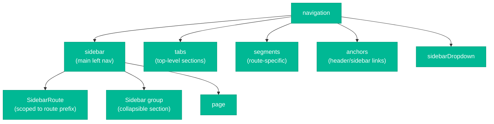

| Type | Purpose |
|---|---|
| `sidebar` | Main left navigation — hierarchical with routes, groups, pages |
| `tabs` | Top-level tab navigation — major documentation sections |
| `segments` | Route-specific navigation — appears only for matching routes |
| `anchors` | Fixed elements — header links, social links, CTA buttons |
| `sidebarDropdown` | Dropdown menu in the sidebar |

The sidebar supports multi-level routing — `SidebarRoute` objects define navigation scoped to a route prefix. When you navigate to `/docs/api/users`, xyd finds the most specific matching route and shows only that section's sidebar.

Navigation hooks (`useActivePage`, `useMatchedSegment`, `useActivePageRoute`) resolve the current route against the navigation config for active state highlighting and breadcrumb building.

## Virtual Modules

Vite plugins that generate module content at build time without physical files on disk. They bridge configuration (from `docs.json`) to runtime application code.

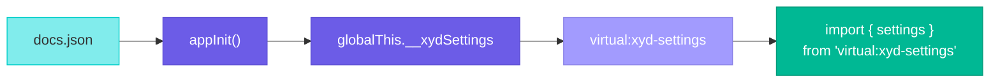

Each virtual module plugin implements two Vite hooks:
- `resolveId(id)` — matches `virtual:*` module IDs
- `load(id)` — generates JavaScript code string on-the-fly

Virtual modules participate in HMR — when settings or plugin sources change, the dev server invalidates the affected virtual modules and triggers a reload.

## Surfaces

Named injection points in the UI where themes and plugins can place React components without modifying layout code directly.

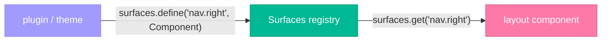

The `Surfaces` class (from `@xyd-js/framework`) acts as a registry — themes call `surfaces.define(target, component)` to register elements at specific locations, and layout components read them via `surfaces.get(target)` through the `SurfaceContext`.

Targets follow a dot-notation naming convention like `nav.right`, `sidebar.top`, `page.footer.bottom`.

## Uniform

The normalized, language-agnostic data format for API documentation. It's the central abstraction between API spec parsers and UI rendering.

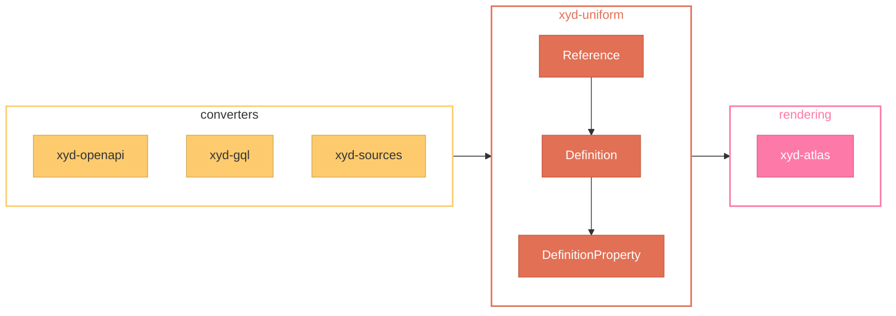

Three-level type hierarchy:

| Type | Role |
|---|---|
| `Reference` | Top-level — an API endpoint or schema. Contains title, canonical URL, definitions, examples, type, context |
| `Definition` | Logical grouping — "query parameters", "request body", "response". Contains properties and variants |
| `DefinitionProperty` | Individual property — name, type, description, nested properties, metadata (required, deprecated, defaults) |

Special property types: `$$union` (anyOf), `$$xor` (oneOf), `$$array` (array), `$$enum` (enum).

## Atlas

The API reference UI component library (`xyd-atlas`) that renders Uniform data into interactive documentation.

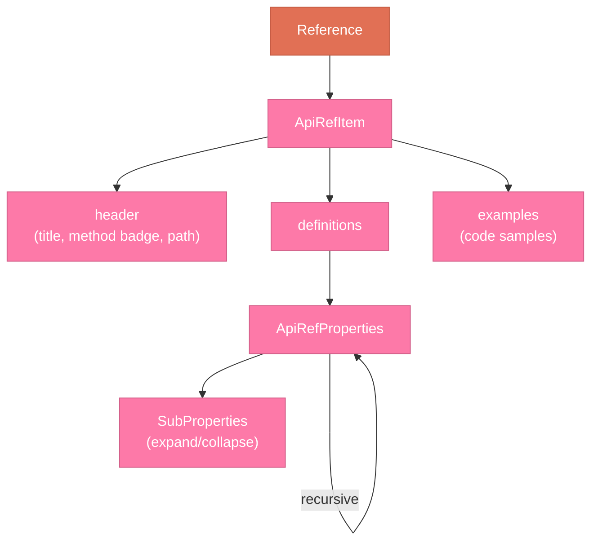

Key components:

| Component | Purpose |
|---|---|
| `ApiRefItem` | Top-level — renders a complete API reference page from a `Reference` object |
| `ApiRefProperties` | Recursive property tree — renders `DefinitionProperty` with type symbols, metadata badges, nested expansion |

Features:
- **Variant selection** — dropdowns for status codes, content types (managed by `VariantContext`)
- **Type symbol resolution** — `$$array` shows "array of string", `$$union` shows "typeA or typeB"
- **Property linking** — properties with `symbolDef.canonical` render as clickable links
- **Metadata badges** — required, deprecated, defaults, examples