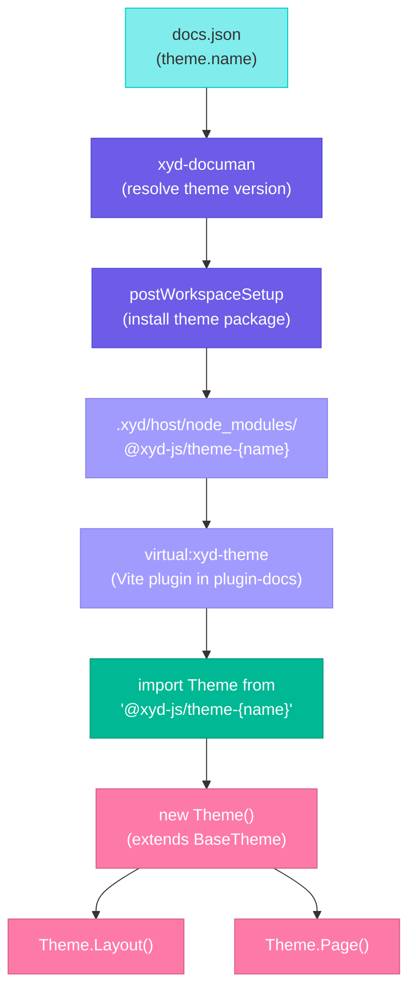
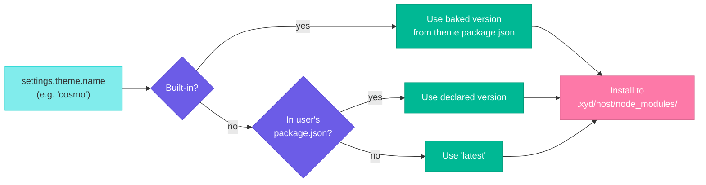
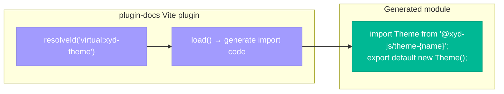
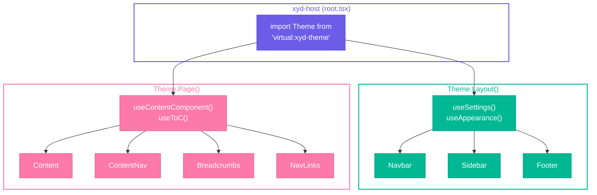

# Themes

This page documents the theme system in xyd - how themes are resolved, installed, loaded at runtime, and rendered.

## Architecture



## Theme Resolution

When `xyd dev` or `xyd build` starts, `xyd-documan` resolves the theme package and version:



### Built-in theme versions

`xyd-documan` imports each built-in theme's `package.json` at build time and bakes their versions into a lookup map:

| Theme | Package |
|-------|---------|
| poetry (default) | `@xyd-js/theme-poetry` |
| cosmo | `@xyd-js/theme-cosmo` |
| opener | `@xyd-js/theme-opener` |
| picasso | `@xyd-js/theme-picasso` |
| gusto | `@xyd-js/theme-gusto` |
| solar | `@xyd-js/theme-solar` |

This ensures users always get a compatible theme version without declaring it in their `package.json`.

### Custom themes

For themes not in the built-in list, `xyd-documan` checks the user's `package.json` for a declared version. If none is found, it installs `latest`.

## Installation

During `postWorkspaceSetup`, the resolved theme package is installed into `.xyd/host/node_modules/` alongside other framework dependencies. The package manager is auto-detected (bun, pnpm, or npm).

## Virtual Module: `virtual:xyd-theme`

The `xyd-plugin-docs` Vite plugin generates `virtual:xyd-theme` at build time:



In dev mode (`XYD_DEV_MODE`), it resolves the theme from the local monorepo source instead of an installed package.

## Theme CSS

Two additional virtual modules handle theme styles:

| Virtual Module | Purpose |
|---|---|
| `virtual:xyd-theme/index.css` | Theme's compiled stylesheet |
| `virtual:xyd-theme-override/index.css` | User appearance overrides via `generateUserCss()` |

## BaseTheme Class

All themes extend `BaseTheme` and implement rendering methods:

| Method | Purpose |
|--------|---------|
| `Layout` | Root structure — navbar, sidebar, footer, content area |
| `Page` | Content area — main content, TOC, breadcrumbs, nav links |
| `Navbar` | Top navigation bar |
| `Sidebar` | Left sidebar with navigation tree |
| `Content` | Main content rendering |
| `ContentNav` | Right sidebar with TOC |
| `Footer` | Site-wide footer |
| `Breadcrumbs` | Breadcrumb navigation |
| `NavLinks` | Previous/next page navigation |

## Configuration

```json
{
  "theme": {
    "name": "poetry",
    "appearance": {
      "colorScheme": "auto",
      "colorSchemeButton": true,
      "colors": {
        "primary": "#6c5ce7"
      },
      "cssTokens": {},
      "fonts": {}
    }
  }
}
```

| Property | Type | Description |
|----------|------|-------------|
| `name` | string | Theme identifier (built-in or custom package) |
| `appearance.colorScheme` | `"light" \| "dark" \| "auto"` | Color scheme mode |
| `appearance.colorSchemeButton` | boolean | Show light/dark toggle |
| `appearance.colors.primary` | string | Primary color (generates variants) |
| `appearance.cssTokens` | object | Override CSS custom properties |
| `appearance.fonts` | object | Custom font configuration |

## Rendering Flow



## Hot Reload

During development, theme changes trigger different reload strategies:

| Change | Strategy |
|--------|----------|
| `theme.name` changed | Full server restart (new theme package) |
| `theme.appearance` changed | HMR via `virtual:xyd-theme-override/index.css` |
| Theme source code (dev mode) | Vite HMR |