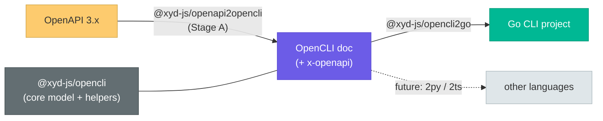

# OpenCLI CLI Generation

This document describes the **OpenAPI → OpenCLI → CLI** pipeline: how xyd turns an OpenAPI 3.x
spec into a *functional* command-line interface that makes real HTTP requests. It covers the
three packages involved, the `x-openapi` request-binding extension, the mapping algorithm, the
Go generator, and the test/CI setup.

> User-facing entry point: `apps/docs/guides/opencli.md`. This page is the under-the-hood view.

## Overview

The conversion is split into composable, independently testable stages. The intermediate
format is [OpenCLI](https://opencli.org) — an open spec that describes a CLI's *surface*
(command tree, arguments, options). To generate a CLI that actually *calls* the API, the
OpenCLI document also carries an **`x-openapi`** extension that binds each command back to its
HTTP request.



## Packages

| Package | Role | Key exports |
|---------|------|-------------|
| `@xyd-js/opencli` | Core OpenCLI model + helpers (extracted from `@xyd-js/opencli-remark`) | `OpencliSpecJson`, `Command`, `loadOpencliSpec()`, `findCommand()`, `generate*()` |
| `@xyd-js/openapi2opencli` | **Stage A** — OpenAPI → OpenCLI (+ `x-openapi`) | `openapi2opencli()`, `openapi2opencliFromSource()`, `opencliToSurface()`, `diffSurfaces()` |
| `@xyd-js/opencli2go` | OpenCLI → buildable Go CLI project | `opencli2go()`, `writeProject()` |

### @xyd-js/opencli (core model)

`@xyd-js/opencli` owns the OpenCLI JSON Schema (`opencli-spec.json`), the generated
`src/types.ts` (via `pnpm --filter @xyd-js/opencli generate:types`), the spec loader
(`spec.ts`), and the pure documentation generators (`generate.ts`). It was extracted from
`@xyd-js/opencli-remark`, which now consumes it as a `workspace:*` dependency — the remark
plugin's existing fixtures prove the extraction is behavior-preserving.

The schema is **extended** (vs. upstream OpenCLI) to allow `x-`-prefixed extension keys plus a
typed `XOpenAPI` `$def`. Extensions are additive, so upstream OpenCLI documents remain valid.

### @xyd-js/openapi2opencli (Stage A)

Reuses `deferencedOpenAPI()` from `@xyd-js/openapi` to read + dereference the spec, then walks
the raw `OpenAPIV3` document (not Uniform, to preserve enum/default/required fidelity) and
emits an OpenCLI document. Public API:

```ts
// pure, sync: dereferenced doc → OpenCLI doc
openapi2opencli(doc: OpenAPIV3.Document, options?: OpenApi2OpenCliOptions): OpencliSpecJson
// convenience: read + dereference a file/URL first
openapi2opencliFromSource(source: string, options?): Promise<OpencliSpecJson>
```

#### Mapping algorithm (default `grouping: "path"`)

| OpenAPI | OpenCLI |
|---------|---------|
| static path segment | command-tree node (kebab); resources auto-created, description from matching tag |
| `{param}` path segment | positional **argument** (required, in path order; enum → `acceptedValues`) |
| method + path shape | leaf **action**: `GET` collection→`list`, `GET` item→`retrieve`, `POST`→`create`, `PUT/PATCH`→`update`, `DELETE`→`delete`, trailing static verb (`/{id}/cancel`)→that verb |
| `query` param | **option** (`group: "query"`) |
| `header`/`cookie` param | **option** (opt-in; well-known auth skipped) |
| request body property | top-level props → **options** (scalars flatten; nested → JSON-string flag) |
| `schema.enum` / `array` / `default` | `acceptedValues` / variadic arity / default in metadata |

Flags are kebab-cased; the original wire name is preserved in option metadata for round-trip.

### @xyd-js/opencli2go (Go generator)

Emits a buildable Go project as a **pure virtual file map** (`Record<path, string>`); the only
filesystem IO is the separate `writeProject(files, outDir)`. The generator uses **templated
emitters** plus tiny Go-literal string helpers (`golit.ts`) — *not* a Go AST (this mirrors the
[fern CLI generator](https://github.com/fern-api/fern/tree/main/generators/cli/src) approach
and avoids a Go toolchain dependency at generation time).

| File | Purpose |
|------|---------|
| `src/project.ts` | `opencli2go()` orchestrator; emits `go.mod` (targets `go 1.22`), `cmd/<bin>/main.go`, `pkg/cmd/<resource>.go`, the vendored runtime |
| `src/command.ts` / `handler.ts` / `flags.ts` / `model.ts` | per-resource command tree, functional handlers, flag wiring |
| `src/runtime.ts` | vendored Go runtime (HTTP client + result printer) |
| `src/golit.ts` | Go-literal string helpers |
| `src/write.ts` | `writeProject()` |

- **Framework:** [urfave/cli v3](https://github.com/urfave/cli) (matches openai-cli).
- **Functional handlers:** each command's `Action` reads `x-openapi` to substitute path params
  from positionals, set query params/body from flags, attach auth from the configured env var,
  call the vendored client, and print the response.

## The `x-openapi` extension

This is what makes generation *functional*. Shape:

- **Root** `x-openapi`: `servers` (base URLs) + `security[]` where each scheme has a normalized
  `kind` (`bearer` | `apiKey-header` | `apiKey-query` | `apiKey-cookie` | `basic` | `other`),
  plus `scheme`, `in`, `name`, `envVar` (e.g. `OPENAI_API_KEY`), `bearerFormat`.
- **Per leaf command** `x-openapi`: `{ method, path, contentType, params[], body }`, where each
  `param`/body property has a `from` linking it to its OpenCLI input — `argument:<name>` or
  `option:<name>` — so the generator knows where each value comes from in the request.

## Tests and fixtures

Both stages keep **per-method fixtures** under `__fixtures__/-2.complex.openai/<method>/`,
following the repo's [fixture convention](../2.1.development/4.TESTS_AND_FIXTURES.md):

| Stage | Fixture dir | Files per method |
|-------|-------------|------------------|
| Stage A | `xyd-openapi2opencli/__fixtures__/-2.complex.openai/<method>/` | `input.json` (OpenAPI op) |
| Generator | `xyd-opencli2go/__fixtures__/-2.complex.openai/<method>/` | `input.json` (OpenCLI), `output.go`, `recorded.json` |

### Conformance oracle

Stage A is conformance-checked against OpenAI as the oracle: the vendored
`oracle/openai-openapi.yaml` spec, the parsed `openai-cli` Go source, and the published
`developers.openai.com` reference docs (≈251 methods). `conformance.test.ts` and
`docs-oracle.test.ts` assert command/flag coverage stays above a recorded floor; an
`allowlist.json` records expected divergences (the backlog is dominated by Stainless's
`admin …` / `beta …` namespacing, which is config-driven and not present in the OpenAPI paths).

### The grouped e2e harness

`xyd-opencli2go/__tests__/e2e/harness.ts` is a reusable, self-contained harness. Adding an API
is ~6 lines (`__tests__/e2e/openai.test.ts`) — point it at the per-method fixtures dir:

```ts
const openai = { name: "openai", cliName: "openai", fixturesDir: ".../-2.complex.openai" }
recordE2E(openai)   // (gated) write recorded.json per method
defineE2E(openai)   // offline binding guard + (gated) real-CLI check
```

The harness merges the committed per-method OpenCLI `input.json` files into one full document
(no OpenAPI/upstream dependency), generates the whole CLI, builds it, runs each command against
an in-process recording server, and diffs the actual request (method/path/query/body/auth)
against `recorded.json`.

### Env gates

The golden-*regenerating* and Go-*requiring* tests are env-gated so the default `pnpm test:unit`
run stays offline and deterministic:

| Env var | Effect | Runs in CI? |
|---------|--------|-------------|
| `O2G_GO_SMOKE=1` | `go build` / `go vet` a sample of generated projects | Yes (Go job) |
| `E2E_CLI=1` | build the whole CLI, run it, diff requests vs fixtures | Yes (Go job) |
| `O2G_BUILD_DOCS=1` | **regenerate** the Stage-B `input.json` / `output.go` goldens | No |
| `E2E_RECORD=1` | **regenerate** the per-method `recorded.json` | No |

> Known gap, surfaced by the fixtures: the generated runtime always assembles a JSON body
> (multipart `--file` uploads are not wired yet). On macOS, generated urfave binaries may fail
> to *execute* (a dyld `LC_UUID` toolchain issue); `go build`/`go vet` still pass. Linux/CI runs
> the binaries fine.

## CI

| Workflow | Covers | Toolchain |
|----------|--------|-----------|
| `tests-unit.yml` (`tests:unit`) | each package's **offline** unit tests (auto-discovered by the root `vitest.config.ts` glob) | Node + pnpm |
| `tests-opencli-pipeline.yml` (`tests:opencli-pipeline`) | the **Go-gated** layers excluded by the root config: `O2G_GO_SMOKE=1` + `E2E_CLI=1` for `@xyd-js/opencli2go`, plus the e2e binding guard | Node + pnpm + **Go 1.22** |

The root `vitest.config.ts` `include` glob (`packages/**/__tests__/**/*.test.ts`) already runs
the three packages' offline tests in `tests:unit`, but it **excludes `**/__tests__/e2e/**`**.
`tests-opencli-pipeline.yml` therefore sets up a Go toolchain and runs each package's
package-local `ci:test` (whose config does not exclude e2e) with the gate env vars, so the full
pipeline — including the real generated-CLI requests — is verified where binaries execute. It is
`paths`-scoped to the three packages to avoid running the heavier Go job on unrelated pushes.
