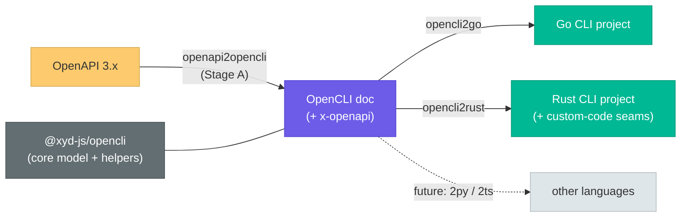

# OpenCLI CLI Generation

This document describes the **OpenAPI → OpenCLI → CLI** pipeline: how xyd turns an OpenAPI 3.x
spec into a *functional* command-line interface that makes real HTTP requests. It covers the
crates involved, the `x-openapi` request-binding extension, the mapping algorithm, the
Go and Rust generators (including the Rust generator's regen-safe custom-code seams), and the
test/CI setup.

The generators live in the `opensdk` submodule alongside the SDK toolchain
(`opensdk/crates/`, workspace rooted at `opensdk/Cargo.toml`) — see
[OpenSDK Generation](./OpenSdkGeneration.md). The OpenCLI core model stays in xyd as
`@xyd-js/opencli`, because the docs engine and `@xyd-js/opencli-remark` render from it.

> The user-facing guide is not published yet (the feature is merged without official user docs);
> this page is the under-the-hood view.

## Overview

The conversion is split into composable, independently testable stages. The intermediate
format is [OpenCLI](https://opencli.org) — an open spec that describes a CLI's *surface*
(command tree, arguments, options). To generate a CLI that actually *calls* the API, the
OpenCLI document also carries an **`x-openapi`** extension that binds each command back to its
HTTP request.


```mermaid
graph LR
    OAS["OpenAPI 3.x"] -->|"openapi2opencli\n(Stage A)"| OCLI["OpenCLI doc\n(+ x-openapi)"]
    OCLI -->|"opencli2go"| GO["Go CLI project"]
    OCLI -->|"opencli2rust"| RUST["Rust CLI project\n(+ custom-code seams)"]
    OCLI -.->|"future: 2py / 2ts"| OTHER["other languages"]

    CORE["@xyd-js/opencli\n(core model + helpers)"] --- OCLI

    style OAS fill:#fdcb6e,color:#333,stroke:#d4a94e
    style OCLI fill:#6c5ce7,color:#fff,stroke:#5a4bd4
    style GO fill:#00b894,color:#fff,stroke:#009a7a
    style RUST fill:#00b894,color:#fff,stroke:#009a7a
    style OTHER fill:#dfe6e9,color:#333,stroke:#b2bec3
    style CORE fill:#636e72,color:#fff,stroke:#4a5558
```

## Packages and crates

| Unit | Role | Key entry points |
|------|------|------------------|
| `@xyd-js/opencli` (xyd) | Core OpenCLI model + helpers | `OpencliSpecJson`, `Command`, `loadOpencliSpec()`, `findCommand()`, `generate*()`, `opencliToReferences()` |
| `openapi2opencli` (opensdk) | **Stage A** — OpenAPI → OpenCLI (+ `x-openapi`) | `openapi2opencli()`, `openapi2opencli_from_file()`, `openapi2opencli_from_json_str()` |
| `opencli2go` (opensdk) | OpenCLI → buildable Go CLI project | `opencli2go()` |
| `opencli2rust` (opensdk) | OpenCLI → buildable Rust CLI project with regen-safe custom-code seams | `opencli2rust()`, `write_project()`, the `regen` bin |
| `opencli2opensdk` (opensdk) | The reverse direction — OpenCLI → OpenSDK IR with `x-cli` argv bindings, for SDKs that drive a CLI | `opencli2opensdk()` |

### @xyd-js/opencli (core model)

`@xyd-js/opencli` owns the OpenCLI JSON Schema (`opencli-spec.json`), the generated
`src/types.ts` (via `pnpm --filter @xyd-js/opencli generate:types`), the spec loader
(`spec.ts`), the pure documentation generators (`generate.ts`), and `opencliToReferences()`,
which turns a command tree into Uniform References for Atlas (`category: "cli"`) through the
napi addon. `@xyd-js/opencli-remark` consumes it as a `workspace:*` dependency — the remark
plugin's existing fixtures prove the extraction is behavior-preserving.

The schema is **extended** (vs. upstream OpenCLI) to allow `x-`-prefixed extension keys plus a
typed `XOpenAPI` `$def`. Extensions are additive, so upstream OpenCLI documents remain valid.

### openapi2opencli (Stage A)

Reads + dereferences the spec through `oas_doc`'s `DocCtx` (a lazy `resolve()` — identity
when there are no `$ref`s), then walks the raw OpenAPI document (not Uniform, to preserve
enum/default/required fidelity) and emits an OpenCLI document. Public API:

```rust
// pure: a resolved doc → OpenCLI doc
openapi2opencli(doc: &Value, options: Option<Options>) -> Spec
// convenience: read + dereference a file first
openapi2opencli_from_file(path: &str, options: Option<Options>) -> Result<Spec, Error>
```

#### Mapping algorithm (default `grouping: "path"`)

| OpenAPI | OpenCLI |
|---------|---------|
| static path segment | command-tree node (kebab); resources auto-created, description from matching tag |
| `{param}` path segment | positional **argument** (required, in path order; enum → `acceptedValues`) |
| method + path shape | leaf **action**: `GET` collection→`list`, `GET` item→`retrieve`, `POST`→`create`, `PUT/PATCH`→`update`, `DELETE`→`delete`, trailing static verb (`/{id}/cancel`)→that verb |
| `query` param | **option** (`group: "query"`) |
| `header`/`cookie` param | **option** (opt-in; well-known auth skipped) |
| request body property | top-level props → **options** (scalars flatten; nested → JSON-string flag) |
| `schema.enum` / `array` / `default` | `acceptedValues` / variadic arity / default in metadata |

Flags are kebab-cased; the original wire name is preserved in option metadata for round-trip.

#### Command grammar (`grammar`)

The table above describes **placement under `noun-verb`**, the default and the shape every
existing golden is frozen in: resource first, action last — `api sdks list`, like `gh` /
`aws` / `stripe`. The `grammar` option selects the other order.

| `grammar` | Shape | Precedent |
|-----------|-------|-----------|
| `noun-verb` (default) | `api sdks list`, `api sdks targets list <id>` | gh, aws, stripe |
| `verb-noun` | `api get sdks`, `api get sdk targets <id>` | kubectl, PowerShell |

`verb-noun` is not a reordering of the same tree. Hoisting the verb to the root makes a
resource's two reads siblings under it, and naively that **collides on our own API**: every
inflector guards an `is` ending (to protect `analysis`, `basis`), so `singularize("apis")` is
`"apis"` and `GET /apis` and `GET /apis/{apiId}` both claim `get apis`.

So it follows kubectl properly. kubectl does *not* make the plural carry meaning — `pod` and
`pods` are synonyms, and the **presence of a name argument** selects the item. A collection
GET and its item GET therefore collapse into **one** command with an optional positional and
both spellings as names:

```
GET /sdks          ─┐   api get sdk            → GET /sdks        (canonical)
GET /sdks/{id}     ─┴─> api get sdks           → GET /sdks        (alias)
                        api get sdk  <id>      → GET /sdks/<id>
                        api get sdks <id>      → GET /sdks/<id>
GET /sdks/{id}/targets  api get sdk targets <id> → GET /sdks/<id>/targets
POST /sdks              api create sdk
DELETE /sdks/{id}       api delete sdk <id>
POST /releases/{id}/publish  api publish release <id>
```

The merged command is **singular-canonical, plural-alias**. Intermediate segments are
singularized (`get sdk targets`), so naming it plural would place it beside its own singular
sibling — which clap rejects.

Nouns follow two clauses:

- **N1** — a static segment immediately followed by `{param}` is singularized.
- **N2** — everything else verbatim, *except* the terminal segment under `create`. So a bulk
  `DELETE /sdks` stays `delete sdks` rather than lying with `delete sdk`, and
  `GET /overview/stats` keeps its plural (`stats` is a real plural of `stat`; it is N2 that
  preserves it, not the inflector).

`singularOverrides` supplies pairs the rules get wrong. It ships **empty** — nothing is
overridden unless you say so.

`apis` is worth spelling out, because it is the case that forced this design and it is easy
to conclude the override is what fixes it. It is not: the **merge** is. With no override the
pair still collapses into one working command, just named for the plural, since singular and
plural are the same word — `api get apis` and `api get apis <id>` both work, with no alias.
Adding `{"apis": "api"}` only changes the naming, to the singular-canonical form the rest of
the tree uses: `api get api [alias: apis]`. apitoolchain declares it for exactly that reason;
it is a readability choice, not a requirement.

The top level is ranked read-then-write (`get`, `create`, `update`, `delete`, …) so `--help`
does not open with `create`. The rank is gated on the grammar rather than on tree depth — a
resource legitimately *named* `get` must not be silently hoisted under `noun-verb`.

> Do not feed `verb-noun` output to `opencli2opensdk`: the SDK resources would be named after
> the verbs (`client.get.sdks()`).

Both backends support a command that is runnable **and** a parent, which is what the merged
read command requires, and both branch on the positional to choose between the two bindings
carried in one `x-openapi` block (see `whenArgsPresent` below). The request either backend
sends for a given argv is identical.

One consequence needed a per-framework fix. If such a parent has a **required** option, both
CLI frameworks enforce it before dispatching to a child, so `api create sdk target <id>` fails
demanding the `--api-id` that belongs to `api create sdk` — every subcommand of the parent
unreachable. clap has exactly this switch (`subcommand_negates_reqs`); urfave has none, so
`opencli2go` declares the flag non-required and checks it inside the parent's own `Action`,
reproducing urfave's own error message.

### opencli2go (Go generator)

`opencli2go(spec, options)` returns a **pure virtual file map** (`BTreeMap<path, contents>`) —
no filesystem IO at all. The generator uses **templated emitters** plus tiny Go-literal string
helpers (`golit.rs`) — *not* a Go AST (this mirrors the
[fern CLI generator](https://github.com/fern-api/fern/tree/main/generators/cli/src) approach
and avoids a Go toolchain dependency at generation time).

| Module | Purpose |
|--------|---------|
| `lib.rs` | `opencli2go()` orchestrator; emits `go.mod` (targets `go 1.22`), `cmd/<bin>/main.go`, `pkg/cmd/<resource>.go`, the vendored runtime |
| `command.rs` / `handler.rs` / `flags.rs` / `model.rs` / `maincmd.rs` | per-resource command tree, functional handlers, flag wiring, root command |
| `runtime.rs` + `runtime.go.txt` | vendored Go runtime (HTTP client + result printer) |
| `golit.rs` / `naming.rs` | Go-literal string helpers · identifier casing + keyword guards |

- **Framework:** [urfave/cli v3](https://github.com/urfave/cli) (matches openai-cli).
- **Functional handlers:** each command's `Action` reads `x-openapi` to substitute path params
  from positionals, set query params/body from flags, attach auth from the configured env var,
  call the vendored client, and print the response.

### opencli2rust (Rust generator)

The Rust sibling of `opencli2go`: same layering (`lib.rs` / `command.rs` / `handler.rs` /
`flags.rs` / `model.rs` / `runtime.rs`), same templated-emitter approach (`rslit.rs` renders
clap builder-method chains; naming helpers shared with `opensdk_rust`). Stack:
**clap v4 (builder API)** + async **reqwest/tokio**; the vendored runtime executes requests
and returns the decoded value. Request-level behavior is byte-compatible with the Go generator
against the shared `recorded.json` fixtures.

Two deliberate divergences from the Go generator:

1. **File map with write modes + the framework write lifecycle.** `opencli2rust()` returns a
   `FileMap` whose entries carry a per-file `WriteMode`, and the crate re-exports
   `opensdk_framework`'s `write_project` — `.sdk/sdk.lock` manifest, guarded stale-prune,
   `.sdkignore`, and opt-in `{ merge: true }` 3-way merge (where opencli2go leaves writing to
   the caller).
2. **Custom-code seams** (the Fern / Oxide-progenitor concept). The generated crate splits
   `src/gen/**` (regenerated, "DO NOT EDIT") from `src/custom/mod.rs` (scaffolded once,
   `skipIfExists`). Three extension points, wired through the generated `main.rs`:
   - the `CliOverrides` trait (`before_request` / `transform_response` / `recover_error` /
     `print_success` / `print_error`, all defaulted; printing lives ONLY in the trait, which
     is why the runtime returns values instead of printing like Go's `runtime.Do`);
   - the `CustomCommands` registry — `commands.add(&["tools"], Command::new("hello"), |ctx, m| async …)`
     grafts new commands anywhere in the clap tree, and a registration on an EXISTING path
     overrides that command's behavior (custom-first dispatch);
   - `Context` (`execute` / `execute_raw`) so custom handlers reuse the CLI's base URL + auth.
   `__fixtures__/5.custom-scaffold/` holds the reference customization (`input.json` +
   a `custom.rs` exercising all three seams).

The biggest consumer of both divergences is xyd's own CLI: `crates/xyd_cli` is a generated
crate (`src/opencli/**` from the spec, `src/v0/**` hand-owned), regenerated by this crate's
`regen` bin, which reads the target crate's `regen.toml`, runs `opencli2rust` → `write_project`
→ `cargo fmt`. Because the driver lives in the submodule and its target does not, regeneration
is a two-workspace invocation from the repo root:

```bash
cargo run --manifest-path opensdk/Cargo.toml -p opencli2rust --bin regen -- crates/xyd_cli
```

### `opensdk` integration (`go-cli` / `rust-cli` targets)

The pipeline has a command-line entry point through the **`opensdk` CLI** (see
[OpenSDK Generation](./OpenSdkGeneration.md)): the pseudo-language target ids `go-cli` and
`rust-cli` work in `opensdk generate --lang`, sdk.json sections, and `chain.json` targets.
`opensdk`'s `src/cli_targets.rs` routes them before the emitter registry (CLI
generation consumes the raw OpenAPI doc, not the OpenSDK IR), runs `openapi2opencli` →
`opencli2go`/`opencli2rust`, and writes through the framework `write_project` — so the regen
lifecycle (lock, stale-prune, `.sdkignore`, `--merge`) applies to BOTH backends, Go included.
Options are one flat bag split by allowlist (converter vs backend keys); `sdkName` defaults
`cliName`. Chain example: `apitoolchain/sdk.json` target `api-cli`
(`target: "rust-cli"`).

## The `x-openapi` extension

This is what makes generation *functional*. Shape:

- **Root** `x-openapi`: `servers` (base URLs) + `security[]` where each scheme has a normalized
  `kind` (`bearer` | `apiKey-header` | `apiKey-query` | `apiKey-cookie` | `basic` | `other`),
  plus `scheme`, `in`, `name`, `envVar` (e.g. `OPENAI_API_KEY`), `bearerFormat`.
- **Per leaf command** `x-openapi`: `{ method, path, contentType, params[], body }`, where each
  `param`/body property has a `from` linking it to its OpenCLI input — `argument:<name>` or
  `option:<name>` — so the generator knows where each value comes from in the request.
- **`whenArgsPresent`** (optional, `verb-noun` only): a second, nested binding of the same
  shape. A command carrying it has TWO requests and picks between them on whether its optional
  positional was supplied — the merged list/retrieve command above. The discriminator is the
  argument the alternate path uses and the primary does not.

  ```jsonc
  "x-openapi": {
    "method": "get", "path": "/sdks",          // no positional -> list
    "whenArgsPresent": {                        // positional given -> retrieve
      "method": "get", "path": "/sdks/{id}",
      "params": [{ "in": "path", "name": "id", "from": "argument:id" }]
    }
  }
  ```

  It is `skip_serializing_if = "Option::is_none"`, so every document that does not need it is
  byte-identical to before the field existed.

## The `x-cli` extension

The other direction: `x-openapi` is what the converter **writes into** the OpenCLI document;
`x-cli` is what it **reads from** the OpenAPI document. It is the sibling of `x-sdk`, which
`opensdk xsdk` already embeds in OpenAPI specs — `x-sdk` carries SDK docs, `x-cli` carries
CLI-generation hints, both written next to the API they describe rather than in a build config
on the other side of the repo.

### Root block — converter options

```yaml
x-cli:
  cliName: acme
  grammar: verb-noun
  singularOverrides: { apis: api }
```

It deserializes into **the same `Options` type** the converter config uses and merges
field-wise, so every converter option is spec-settable without maintaining a second list.

### Per operation / per path item

| Field | Effect |
|-------|--------|
| `grammar` | Word order for THIS command — the whole of grammar mixing |
| `group` | Replace the derived resource path (`"billing invoices"`; `""` mounts at top level) |
| `verb` | Replace the derived action verb (the leaf's own name) |
| `aliases` | Replace the derived aliases (empty list removes them) |
| `hidden` | Keep the command working but out of `--help` |
| `ignore` | Drop the operation from the CLI entirely |
| `description` | Replace the summary/description used as help text |

### Precedence

**Specificity beats source** — the ladder `openapi2opensdk` already set for `x-open-sdk-*`:

```
operation  >  path item  >  converter config  >  root x-cli  >  built-in default
```

Converter config sits above the root block deliberately: that is the operator overriding the
spec on purpose. It sits below the per-operation block for the same reason in reverse.

Both merges are written out field by field with no `..base` rest pattern — a rest pattern
would silently inherit the base value for any field added later, so a new option would appear
to work while ignoring the spec.

A malformed block **warns to stderr and is ignored** rather than failing the conversion: this
is spec-authored hint data, and a typo in it should not take down a build that has a perfectly
good converter config.

### Mixing

Because `grammar` is decided per operation, one document holds both word orders with no extra
machinery — no path-glob matcher, no `{default, overrides}` object form. Anything broader than
a single operation is already expressible as an **OpenAPI Overlay** (`opensdk_chain`'s
`chain.sources[].overlays`), which is a standard rather than a dialect of our own.

Read-pairing consults each leaf's **own** grammar, not the converter-wide one: merging a pair
whose halves were not both placed verb-first would put the command somewhere neither asked
for. `__fixtures__/9.x-cli-operation` is the mixing case — a verb-noun document with one pair
opting back into noun-verb.

> **On the name.** `x-cli` also means something else on an OpenSDK **IR**: "this SDK spawns a
> binary" (`opensdk_cli_common::is_cli_spec`), which puts all seven emitters into CLI mode.
> Reusing it is safe only because Stage A builds a typed IR and drops unknown root keys, so an
> OpenAPI `x-cli` cannot reach that sniff. That is asserted, not assumed —
> `openapi2opensdk/tests/x_cli_namespace.rs` — because if a root-extension passthrough were
> ever added, an OpenAPI doc carrying CLI hints would silently generate seven
> process-spawning SDKs.

## Tests and fixtures

Each crate carries its own fixtures, following the repo's
[fixture convention](../2.1.development/4.TESTS_AND_FIXTURES.md). `tests/parity.rs` runs the
numbered ones and compares byte-exactly — a whole `output/` tree for the generators, a
canonicalized `output.json` for Stage A:

| Stage | Fixture dir | Numbered case | Per-method case (`-2.complex.openai/<method>/`) |
|-------|-------------|---------------|--------------------------------------------------|
| Stage A | `openapi2opencli/__fixtures__/` | `input.yaml` → `output.json` | `input.json` (OpenAPI op) + `expected.json` |
| Go generator | `opencli2go/__fixtures__/` | `input.json` (OpenCLI) → `output/` | `input.json`, `output.go`, `recorded.json` |
| Rust generator | `opencli2rust/__fixtures__/` | `input.json` (OpenCLI) → `output/` | `input.json`, `output.rs`, `recorded.json` |

The per-method corpus is the OpenAI surface — 251 operations at Stage A, 201 at each of the
generators — and both generators keep their own copy of the language-neutral files so each
crate stays self-contained. A `recorded.json` is the request the built CLI
actually sent for that method (method/path/query/body/auth), captured against an in-process
recording server; the two backends' copies are what makes their request compatibility a
comparison rather than a claim.

### Conformance oracle

The per-method corpus is derived from OpenAI as the oracle: the spec, the parsed `openai-cli`
Go source, and the published `developers.openai.com` reference (≈251 methods). The oracle stays
vendored and encrypted as a single opaque archive —
`opensdk/crates/openapi2opencli/oracle/oracle.enc`, restored by `oracle/decrypt.sh` with
`XYD_CONTENT_SECRET` (env, else the gcloud secret of that name).

### Env gates

| Env var | Effect | Runs in CI? |
|---------|--------|-------------|
| `XYD_PARITY_DUMP=1` | write the actual conversion result beside the fixture as `output.rust.json` for inspection | No |
| `XYD_BLESS=1` | **regenerate** the `opencli2opensdk` goldens instead of checking them | No |

> Known gap, surfaced by the fixtures: the generated runtime always assembles a JSON body
> (multipart `--file` uploads are not wired yet). On macOS, generated urfave binaries may fail
> to *execute* (a dyld `LC_UUID` toolchain issue); `go build`/`go vet` still pass. Linux/CI runs
> the binaries fine.

## CI

| Workflow | Covers | Toolchain |
|----------|--------|-----------|
| `opensdk/.github/workflows/ci.yml` (`rust`) | the three generator crates: fmt, clippy, and the golden `cargo test --workspace` | Rust stable (+ Node for the harness) |
| `xyd/.github/workflows/tests-native.yml` (`opensdk`) | the same suite re-run inside the submodule on every gitlink bump — the gate that catches a bump which is green standalone but red under xyd's toolchain/feature unification | Rust stable |
| `xyd/.github/workflows/tests-opencli-pipeline.yml` (`tests:opencli-pipeline`) | `@xyd-js/opencli` — the core model + schema round-trip | Node + pnpm |

`tests-opencli-pipeline.yml` is `paths`-scoped to the bare `apitoolchain` gitlink and needs no Go or
Rust toolchain: what would require them are the generator crates, which opensdk's own CI owns.
`tests-native.yml`'s `paths` list spells the submodule `opensdk`, not `opensdk/**` — a change
inside a submodule appears in the parent as a modification of the gitlink path itself, so a
`/**` glob would never match and the gate would silently skip.
