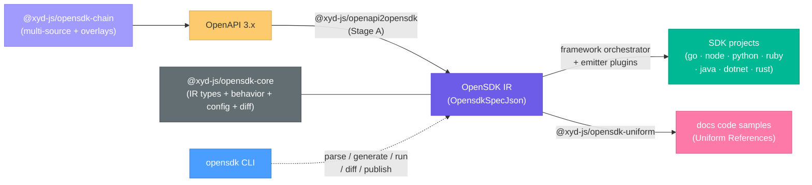

# OpenSDK Generation

This document describes the **OpenAPI → OpenSDK IR → SDK** pipeline: how xyd turns an OpenAPI
3.x spec into typed, functional client SDKs for seven languages. It covers the `xyd-opensdk-*`
package family, the IR, the emitter plugin contract, the regen-safe write lifecycle, the
`opensdk` CLI, the chain pipeline, and the test/CI setup.

> Sibling pipeline: [OpenCLI CLI generation](./OpenCliCliGeneration.md) turns specs into
> command-line tools; both share the regen-safe `writeProject` lifecycle described below.

## Overview

The conversion is split into composable, independently testable stages. The intermediate
format is the **OpenSDK IR** (`OpensdkSpecJson`) — a normalized description of an API client:
a symbol table of named types, a nested resource tree of typed methods with HTTP bindings,
and a declarative runtime-behavior block.



## Packages

| Package | Role |
|---------|------|
| `@xyd-js/opensdk-core` | Layer-0: IR types (`OpensdkSpecJson`), `SdkBehavior` defaults + merge, spec helpers (`loadOpensdkSpec`, `walkMethods`), config shapes (`SdkJson`, `ChainJson`), `diffIR` breaking-change classifier |
| `@xyd-js/opensdk-schemas` | JSON Schemas: `sdk.schema.json` (validates sdk.json) + `chain.schema.json` (validates chain.json), generated from core's `opensdk-spec.json` |
| `@xyd-js/openapi2opensdk` | **Stage A** — OpenAPI → OpenSDK IR; also the conformance "surface" utilities |
| `@xyd-js/opensdk-framework` | The `Emitter` plugin contract, orchestrator, language registry, `planOperation`/`planExample`, and the regen-safe `writeProject` lifecycle |
| `@xyd-js/opensdk-{go,node,python,ruby,java,dotnet,rust}` | Per-language emitters (7) |
| `@xyd-js/opensdk-cli` | The `opensdk` binary: `parse` / `generate` / `diff` / `publish` / `run` / `init` |
| `@xyd-js/opensdk-chain` | `chain.json` pipeline: multi-source OpenAPI merge + Overlay 1.0.0, then generate/publish per target |
| `@xyd-js/opensdk-merge` | `merge3(base, ours, theirs)` — the 3-way line merge behind `{ merge: true }` regeneration |
| `@xyd-js/opensdk-ci` | Shared test infra: goldens, compile smokes, recording/mock servers, behavior parity, publish round-trips |
| `@xyd-js/opensdk-uniform` | Docs integration: enrich Uniform References with per-language SDK snippets + type references |

## The OpenSDK IR (`@xyd-js/opensdk-core`)

`opensdk-spec.json` (JSON Schema) is the single source of truth: `src/types.ts` is generated
from it via `json-schema-to-typescript`, and `xyd-opensdk-schemas` lifts its `$defs` into the
config schemas.

```ts
interface OpensdkSpecJson {
  opensdk: string;          // format version
  info: SdkInfo;
  servers?: string[];
  security?: SdkSecurity[]; // normalized: kind = bearer | apiKey-header/query/cookie | basic | other (+ envVar)
  types?: NamedType[];      // symbol table: struct | enum | union | alias
  resources?: Resource[];   // nested resource tree; each Method = typed SDK call + HTTP binding
  sdk?: SdkBehavior;        // declarative runtime behavior
}
```

| Type | Role |
|------|------|
| `NamedType` | Named type in the symbol table; `kind` discriminates `struct \| enum \| union \| alias` |
| `Resource` / `Method` | Client tree node / typed method with HTTP binding (action, httpMethod, path, params, body, responses, pagination, security) |
| `Param` / `Field` | Path/query/header param · struct field (wire name, required/nullable/deprecated/default) |
| `TypeRef` | Structural reference: `scalar \| ref \| array \| map \| any` |
| `Pagination` | `style: cursor \| page \| offset` + items/cursor/offset/limit/next field names |

**`SdkBehavior`** is the declarative "how SDKs behave at runtime" block, resolved by
`sdkBehavior(spec)` (defaults deep-merged with overrides; arrays replace): retry
(maxRetries=2, retryable status codes, exponential backoff + jitter), timeout (60s), error
mapping, user-agent (incl. AI-agent env detection: `CLAUDE_CODE`, `CURSOR_AGENT`, …),
telemetry headers, logging, idempotency-key injection for retried POSTs, auto-page delay, and
request-guard (misplaced-option detection). Every emitter must render the same behavior — see
"parity" under Tests.

**`diffIR(base, head)`** classifies IR changes as `breaking | risky | safe` across ~30 kinds
(`method-removed`, `param-type-changed`, `field-required-flip`, `enum-value-removed`, …) —
this powers `opensdk diff --fail-on breaking`.

## Stage A: `@xyd-js/openapi2opensdk`

```ts
openapi2opensdk(doc: OpenAPIV3.Document, options?: OpenApi2OpenSdkOptions): OpensdkSpecJson
openapi2opensdkFromSource(source: string, options?): Promise<OpensdkSpecJson>
```

Options: `sdkName`, `includeMethods`/`includePaths`, `verbMap`/`customActionVerbs`,
`authEnvVar`, `operationHints`, `mountRules` (resource-tree regrouping), `sdkBehavior`.

| Module | Purpose |
|--------|---------|
| `nominal.ts` | `SymbolTable` — resolves `$ref`-keyed component schemas into `NamedType[]`, preserving nominal identity (works on the RAW, un-dereferenced doc) |
| `resourceTree.ts` | Builds the nested `Resource[]` tree from operations |
| `action.ts` | `deriveTarget()` — resource path + action verb from method + URL shape (list/retrieve/create/update/delete + trailing verbs) |
| `method.ts` / `schema.ts` / `security.ts` | Per-operation `Method` construction · OpenAPI schema helpers · security normalization |
| `surface.ts` | `opensdkToSurface()` + `diffSurfaces()` — reduce the IR and a real SDK's parsed surface to a canonical shape and diff them (the conformance oracle mechanism, same idea as the OpenCLI pipeline's) |

## The framework (`@xyd-js/opensdk-framework`)

Emitters are **plugins** implementing the `Emitter` contract; capability methods are PURE
(IR in, files out — no IO):

```ts
interface Emitter {
  language: string;
  fileHeader?(ctx): string | null;                     // optional ownership header
  generateProject(spec, ctx): GeneratedFile[];         // manifest, README, configs
  generateClient(spec, ctx): GeneratedFile[];
  generateTypes(types, ctx): GeneratedFile[];
  generateResources(resources, ctx): GeneratedFile[];
  generateRuntime(spec, ctx): GeneratedFile[];
  generateTests?(spec, ctx): GeneratedFile[];          // optional
  generateUsage?(method, chain, ctx): string;          // optional: docs snippets
  generateTypeReference?(method, chain, ctx): RenderedTypeReference; // optional: docs types
}
```

- `orchestrator.ts` — `generate()` / `generateFileMap()` drive the capabilities in order,
  prepend the file header, and assemble the virtual file map (duplicate paths throw).
- `registry.ts` — `registerEmitter()` / `getEmitter()` / `resolveLanguage()` with aliases
  (`ts`/`typescript`/`js` → node, `rs` → rust, `c#`/`.net` → dotnet, …). `applyConfig()` lets
  an `opensdk.config.*` file register **custom emitters as plugins**.
- `operation-plan.ts` — `planOperation(method, types)` → semantic plan (page class name,
  `encoding: json | multipart | form`, param groups, primary-response classification,
  idempotency injection) so emitters share one interpretation of a Method.
- `example-plan.ts` — language-neutral example values, shared by `generateTests` and
  `generateUsage` so every language exercises identical shapes.

### The write lifecycle (regen safety)

`writeProject(files, outDir, { generator, merge })` is the ONLY fs-touching entry point,
shared by every generator (including `opencli2rust`):

1. **`.sdkignore`** — user-authored, gitignore-style: matched paths are user-owned (never
   overwritten or pruned; divergence reported in `conflicts`). Wins over any writeMode.
2. **Per-file `WriteMode`** — `overwrite` | `skipIfExists` (scaffolds, never clobbered) |
   `mergeJson` (deep-merge generated JSON into the user's; user keys win).
3. **`.sdk/sdk.lock`** — hash manifest of pristine generated content; enables the guarded
   stale-prune (only pristine orphans are deleted; modified ones are kept → `keptModified`)
   and byte-stable no-op regens.
4. **`{ merge: true }`** — hand-edits to `overwrite` files survive regeneration via
   `merge3` from `@xyd-js/opensdk-merge` (base = the `.sdk/base/<sha256>` content-addressed
   snapshot, ours = on-disk, theirs = new generation); conflicts get git-style markers →
   `mergeConflicts`.

Result buckets: `written / skipped / unchanged / pruned / keptModified / conflicts / merged /
mergeConflicts`.

## Emitters

All generated SDKs are **dependency-light by design** — stdlib HTTP wherever the platform
allows:

| Package | Generated stack | Smoke gate |
|---------|-----------------|------------|
| `xyd-opensdk-go` | stdlib `net/http` (zero deps) | `O2S_GO_SMOKE` |
| `xyd-opensdk-node` | global `fetch` + built-ins (zero deps, Node 18+) | `O2S_NODE_SMOKE` |
| `xyd-opensdk-python` | stdlib `urllib` | `O2S_PY_SMOKE` |
| `xyd-opensdk-ruby` | stdlib `net/http` + `json` | `O2S_RUBY_SMOKE` |
| `xyd-opensdk-java` | `java.net.http.HttpClient` + hand-rolled JSON codec | `O2S_JAVA_SMOKE` |
| `xyd-opensdk-dotnet` | `System.Net.Http` + `System.Text.Json` | `O2S_DOTNET_SMOKE` |
| `xyd-opensdk-rust` | async `reqwest` (rustls) + `tokio` + `serde` + `thiserror` | `O2S_RUST_SMOKE` |

Each emitter follows the same internal layout (a writer module with language-literal helpers,
`naming.ts` with keyword guards, per-capability renderers) and ships golden fixtures
(`__fixtures__/<n>/input.json` → `output/` tree) plus per-method complex-corpus fixtures.
Representative generated layout (go): `go.mod`, `client.go`, `types.go`, `<resource>.go` +
`_test.go`, `option/`, `internal/requestconfig/`, `packages/{apijson,pagination,param}/`.

## The `opensdk` CLI (`@xyd-js/opensdk-cli`)

Also reachable through the main `xyd` CLI as an opt-in component: `xyd components install
opensdk` downloads the toolchain into `~/.config/xyd/components/`, after which
`xyd opensdk <command>` passes through to it (the default `xyd` install ships none of it —
see `3.cli/InstallationAndCli.md` § Optional Components).

| Command | Purpose / key flags |
|---------|---------------------|
| `opensdk parse` | OpenAPI → IR JSON. `--spec` (required), `--output`, `--sdk-name`, `--grouping` |
| `opensdk generate` | Generate one language (`--lang`, incl. the CLI targets `go-cli`/`rust-cli`) or all configured. `--spec`, `--output`, `--dry-run`, `--no-tests`, **`--merge`** (3-way merge regen) |
| `opensdk diff <base> <head>` | IR-to-IR breaking-change diff. `--fail-on breaking\|risky\|any`, `--json` |
| `opensdk publish` | Publish a generated SDK. `--lang`, `--output`, `--registry`, `--dry-run` |
| `opensdk run` | Execute a `chain.json` pipeline. `--chain`, `--target`, `--source`, `--publish`, `--dry-run` |
| `opensdk init` | Scaffold config. `--format json\|mjs`, `--lang`, `--chain` |

Config resolution (root `--config` overrides discovery): **`sdk.json`** (declarative; per-language
sections with `output`/`behavior`/`publish` + emitter options) wins over
**`opensdk.config.{ts,js,mjs}`** (JS plugin bundle — the place to register custom emitters).
`--grouping <file>` loads `{ mountRules, operationHints }` to reshape the resource tree.

### CLI output targets (`go-cli` / `rust-cli`)

The toolchain can also output **command-line tools** via the
[OpenCLI pipeline](./OpenCliCliGeneration.md) (`openapi2opencli` → `opencli2go`/`opencli2rust`),
surfaced as pseudo-language target ids usable anywhere a language is: `--lang rust-cli`,
`"rust-cli": {...}` sdk.json sections, and `target: "rust-cli"` chain targets. Because CLI
generation consumes the **raw OpenAPI doc** (not the OpenSDK IR), these are NOT emitters —
`generateCommand` routes them before the registry (`src/cli/cli-targets.ts`), which also covers
chain targets since the chain engine injects that same function. Mechanics: a section is one
flat option bag split by allowlist (converter keys like `cliName`/`bodyStrategy`/`flagCase` vs
backend keys like `binName`/`crateName`/`modulePath` — disjoint, unit-tested); a pre-parsed IR
`--spec` is rejected with a pointer to pass the OpenAPI doc; SDK-tree grouping
(`mountRules`/`operationHints`) is warned-once + ignored; `--no-tests` is a no-op; `--merge`
and the full framework write lifecycle apply to both backends (Go included — its naive writer
is bypassed); `opensdk publish` and chain `--publish` skip CLI targets with a note (no registry
publisher). Real-world example: `packages/apitoolchain-sdk-chain/chain.json`'s `api-cli` target.

## Chain (`@xyd-js/opensdk-chain`)

`chain.json` (`detectChain`: explicit path → `chain.json` → `.chain/chain.json`) declares
named `sources` and `targets`:

- **Sources**: multiple OpenAPI `inputs` merged at **operation granularity** (paths union per
  HTTP method, components union per name, conflicts throw) + `overlays` applied as
  **OpenAPI Overlay 1.0.0** documents (JSONPath `target` via `jsonpath-plus`; `remove` deletes,
  `update` deep-merges). Overlays are the spec-level customization knob — modify the API
  surface BEFORE codegen, complementing the code-level merge story.
- **Targets**: `{ target: <language | go-cli | rust-cli>, source: <name>, output, behavior, options, publish }`.
- `runChain()` processes each referenced source once, generates every target, optionally
  publishes (CLI targets are skipped by publish).

## Docs integration (`@xyd-js/opensdk-uniform`)

Bridges SDK generation into the docs site: `attachSdkExamples(references, rawDoc)` enriches
Uniform `Reference`s in place with per-language usage snippets (each emitter's
`generateUsage`), replacing curl-only tabs; `attachSdkTypes` swaps REST param/response
definitions for SDK type references (`generateTypeReference`) with per-language signatures.
`SDK_LANGS` fixes the switcher order (go, python, typescript, ruby, java, csharp). Consumed by
`apps/apitoolchain-web` (`app/lib/openapi/sdkExamples.server.ts`); exposed to plugins as
`opensdkUniformPlugin` / `opensdkTypesUniformPlugin`.

## Tests and CI

`@xyd-js/opensdk-ci` is the shared harness (imported by every emitter's tests):

| Module | Provides |
|--------|----------|
| `golden.ts` / `corpus.ts` | Fixture primitives + discovery of `<order>.complex.<name>` per-method corpora |
| `compile-smoke.ts` | `compileSmoke(lang, dir)` for all 7 languages (tsc / go build / py_compile / ruby -c / javac / dotnet build / cargo build) |
| `e2e.ts` / `sdk-e2e.ts` | `RecordingServer` + request-binding diff: build the real SDK, drive it, diff the actual HTTP request against committed `recorded.json` |
| `mock.ts` | Spec-shaped mock API (in-repo Prism analog) for running each SDK's own generated test suite |
| `parity.ts` | Cross-language behavior parity: distinctive `SdkBehavior` overrides + containment markers every runtime must render |
| `publish.ts` | Publish round-trips: Verdaccio (npm), pypiserver, gemstash; file feeds for dotnet/Maven/Go/Rust |
| `usage-compile.ts` / `snippet-run.ts` | Compile + run the docs usage snippets |

### Env gates

| Env var | Effect | Runs in CI? |
|---------|--------|-------------|
| `O2S_<LANG>_SMOKE=1` | whole-SDK compile + usage-snippet compile for that language | Yes |
| `E2E_SDK=1` | real-SDK request-binding diff vs `recorded.json` | Yes |
| `E2E_SDK_TESTS=1` | run each generated SDK's own test suite against the mock server | Yes |
| `E2E_SDK_CHAIN=1` | `opensdk run` + chain.json end-to-end (merge + overlay → all languages compile) | Yes |
| `E2E_SDK_PUBLISH=1` | generate → publish to isolated local registry → install back → load | Yes |
| `O2S_BUILD_DOCS=1` | **regenerate** per-method fixture goldens from the oracle | No |

### Workflow

`.github/workflows/tests-opensdk-pipeline.yml` (`tests:opensdk-pipeline`) — paths-scoped to the
opensdk packages; sets up Node + pnpm + Bun + **Go 1.22 + Python 3.11 + Ruby 3.1 + Java 17 +
.NET 8 + Rust stable**, local registries (verdaccio :4873, pypiserver :8081, gemstash :9292),
and runs each package's `ci:test` with the gates above. The conformance oracle (vendored
encrypted spec + reference surfaces under `packages/xyd-openapi2opensdk/oracle/`) is decrypted
via the `XYD_CONTENT_SECRET` repo secret; without it those suites skip gracefully. As with the
OpenCLI job, the root `tests:unit` vitest run covers the offline layers and excludes
`**/__tests__/e2e/**`.
