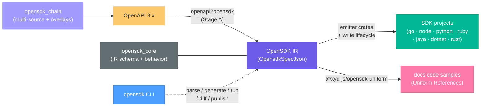

# OpenSDK Generation

This document describes the **OpenAPI → OpenSDK IR → SDK** pipeline: how xyd turns an OpenAPI
3.x spec into typed, functional client SDKs for seven languages. It covers the `opensdk_*`
crate family, the IR, the emitter contract, the regen-safe write lifecycle, the
`opensdk` CLI, the chain pipeline, and the test/CI setup.

The toolchain is its own repo — [github.com/livesession/opensdk](https://github.com/livesession/opensdk) —
pinned here as a submodule at `<repo>/opensdk`, the same arrangement as `xwrite` for the content
engine. Its cargo workspace is rooted at the **submodule root** (`opensdk/Cargo.toml`, members
`crates/*` plus the root-level `cli`, which the glob does not reach), not at `opensdk/crates/`,
so every `cargo` invocation below runs from `opensdk/` and builds into `opensdk/target/`. xyd reaches into it from two places: `packages/xyd-native`
path-deps twelve of the crates into the napi addon, and `crates/xyd_openapi` path-deps
`oas_doc`. Out-of-workspace path deps build normally but are NOT covered by
`cargo fmt --all` / `cargo clippy --workspace` in xyd — opensdk's own CI lints them.

> Sibling pipeline: [OpenCLI CLI generation](./OpenCliCliGeneration.md) turns specs into
> command-line tools; it lives in the same submodule and shares the regen-safe `write_project`
> lifecycle described below.

## Overview

The conversion is split into composable, independently testable stages. The intermediate
format is the **OpenSDK IR** (`OpensdkSpecJson`) — a normalized description of an API client:
a symbol table of named types, a nested resource tree of typed methods with HTTP bindings,
and a declarative runtime-behavior block.



## Crates

All under `opensdk/crates/` except the binary, which sits at `opensdk/cli/` — one level from
the submodule root, not two. That depth matters: anything resolving a path from
`CARGO_MANIFEST_DIR` in that crate walks up once, and its dependencies are reached as
`../crates/<name>` rather than as siblings.

| Crate | Role |
|-------|------|
| `oas_doc` | `DocCtx` — OpenAPI loading + `$ref` resolution. The shared leaf: xyd's own `crates/xyd_openapi` depends on it too |
| `opensdk_core` | Layer-0: `opensdk-spec.json` (the IR schema), `SdkBehavior` defaults + merge, the machine-ownership header, the data-only emitter descriptor, language-neutral example values |
| `opensdk_config` | Config shapes (`SdkJson`, `ChainJson`) + `merge_publish_targets`; `load_opensdk_spec`, `find_type`, `walk_methods` |
| `openapi2opensdk` | **Stage A** — OpenAPI → OpenSDK IR |
| `opensdk_framework` | The regen-safe `write_project` lifecycle + `merge3` |
| `opensdk_{go,node,python,ruby,java,dotnet,rust}` | Per-language emitters (7) |
| `opensdk_diff` | `diff_ir` breaking-change classifier |
| `opensdk` | The `opensdk` binary: `parse` / `xsdk` / `generate` / `diff` / `publish` / `run` / `init`, plus the emitter registry |
| `opensdk_chain` | `chain.json` pipeline: multi-source OpenAPI merge + Overlay 1.0.0 |
| `opencli2opensdk` | OpenCLI → OpenSDK IR carrying `x-cli` argv bindings — SDKs that spawn a CLI instead of making HTTP calls |
| `opensdk_cli_common` | The consume side of the `x-cli` contract (`is_cli_spec`, `CliRoot`, `CliPlan`) + the cross-emitter `testkit` and the language-neutral half of the e2e binding guard |
| `opensdk_e2e` / `parity_kit` | Test harnesses: compile/CLI smokes + recording server · the vendored fixture-parity comparator |

Two TypeScript packages sit on the docs side of the boundary, in xyd:

| Package | Role |
|---------|------|
| `@xyd-js/opensdk-schemas` | JSON Schemas for editor validation: `sdk.schema.json` (validates sdk.json) + `chain.schema.json`, lifted from `opensdk/crates/opensdk_core/opensdk-spec.json` |
| `@xyd-js/opensdk-uniform` | Docs integration: enrich Uniform References with per-language SDK snippets + type references, through the napi addon |

## The OpenSDK IR (`opensdk_core`)

`opensdk-spec.json` (JSON Schema) is the single source of truth for the IR document shape, and
`@xyd-js/opensdk-schemas` lifts its `$defs` into the config schemas. There is no shared typed IR
struct behind it: five emitters read `serde_json::Value` directly and three different map
orderings are already baked into three sets of goldens, so a single shared map type would move
bytes.

```ts
// the document shape, per opensdk-spec.json
interface OpensdkSpecJson {
  opensdk: string;          // format version
  info: SdkInfo;
  servers?: string[];
  security?: SdkSecurity[]; // normalized: kind = bearer | apiKey-header/query/cookie | basic | other (+ envVar)
  types?: NamedType[];      // symbol table: struct | enum | union | alias
  resources?: Resource[];   // nested resource tree; each Method = typed SDK call + HTTP binding
  sdk?: SdkBehavior;        // declarative runtime behavior
}
```

| Type | Role |
|------|------|
| `NamedType` | Named type in the symbol table; `kind` discriminates `struct \| enum \| union \| alias` |
| `Resource` / `Method` | Client tree node / typed method with HTTP binding (action, httpMethod, path, params, body, responses, pagination, security) |
| `Param` / `Field` | Path/query/header param · struct field (wire name, required/nullable/deprecated/default) |
| `TypeRef` | Structural reference: `scalar \| ref \| array \| map \| any` |
| `Pagination` | `style: cursor \| page \| offset` + items/cursor/offset/limit/next field names |

**`SdkBehavior`** is the declarative "how SDKs behave at runtime" block, resolved by
`opensdk_core::behavior` (defaults deep-merged with overrides; arrays replace): retry
(maxRetries=2, retryable status codes, exponential backoff + jitter), timeout (60s), error
mapping, user-agent (incl. AI-agent env detection: `CLAUDE_CODE`, `CURSOR_AGENT`, …),
telemetry headers, logging, idempotency-key injection for retried POSTs, auto-page delay, and
request-guard (misplaced-option detection). Every emitter renders the same resolved block into
its vendored runtime, substituted into `__XYD_*__` seams in an otherwise fixed source file.

**`diff_ir(base, head)`** (in `opensdk_diff`) classifies IR changes as
`breaking | risky | safe` across ~30 kinds (`method-removed`, `param-type-changed`,
`field-required-flip`, `enum-value-removed`, …) — this powers `opensdk diff --fail-on breaking`.

## Stage A: `openapi2opensdk`

```rust
openapi2opensdk(doc: &Value, options: Option<Options>) -> Result<Spec, Error>
openapi2opensdk_from_json_file(path: &str, options: Option<Options>) -> Result<Spec, Error>
```

Pure and synchronous, and it works on the RAW (un-dereferenced) document so component identity
survives into named types. Options: `sdkName`, `includeMethods`/`includePaths`,
`verbMap`/`customActionVerbs`, `authEnvVar`, `operationHints`, `mountRules` (resource-tree
regrouping), `sdkBehavior`.

| Module | Purpose |
|--------|---------|
| `nominal.rs` | `SymbolTable` — resolves `$ref`-keyed component schemas into `NamedType[]`, preserving nominal identity |
| `resource_tree.rs` | Builds the nested `Resource[]` tree from operations |
| `action.rs` | `derive_target()` — resource path + action verb from method + URL shape (list/retrieve/create/update/delete + trailing verbs) |
| `method.rs` / `schema.rs` | Per-operation `Method` construction · OpenAPI schema helpers, including security normalization |
| `jsrt.rs` | The JS-semantics helpers (casing, truthiness) the goldens were frozen under |

## The emitter contract

Each emitter crate exposes one pure `generate_<lang>(spec, options)` — IR in, virtual file map
out, no IO — plus a data-only `EmitterFns` descriptor (`opensdk_core::emitter`) carrying the
language id and the optional docs capabilities (usage snippet, type reference). There is
deliberately no `trait Emitter` mirroring the six capability methods of a plugin contract: each
`generate_<lang>` inlines the interleave in one function, the capability boundaries survive as
comments and file order, and the only consumers (the CLI registry and the napi
`opensdk_surface!` macro) want the whole map anyway.

The registry is a `static EMITTERS` table in `opensdk`, not in core — core is what the
seven emitter crates depend on, so holding the table there would be a cycle. Alias resolution
(`ts`/`typescript`/`js` → node, `rs` → rust, `c#`/`.net` → dotnet, …) stays in
`opensdk_core::emitter::resolve_language`, so the CLI and the emitters cannot drift.

Each emitter carries its own `plan_operation` — the semantic read of a Method (page class name,
`encoding: json | multipart | form`, param groups, primary-response classification, idempotency
injection). They stay per-crate on purpose: six distinct signatures over four different
representations of `types`, so unifying them would change HOW five crates read the IR — on
exactly the code paths that produce every byte-exact golden. What IS shared is the
format→sample table in `opensdk_core::example`, so a `uuid` or `date-time` sample cannot
drift between languages in the docs snippets.

### The write lifecycle (regen safety)

`write_project(files, out_dir, { generator, merge })` in `opensdk_framework` is the ONLY
fs-touching entry point, shared by every generator (including `opencli2rust`):

1. **`.sdkignore`** — user-authored, gitignore-style: matched paths are user-owned (never
   overwritten or pruned; divergence reported in `conflicts`). Wins over any writeMode.
2. **Per-file `WriteMode`** — `overwrite` | `skipIfExists` (scaffolds, never clobbered) |
   `mergeJson` (deep-merge generated JSON into the user's; user keys win).
3. **`.sdk/sdk.lock`** — hash manifest of pristine generated content; enables the guarded
   stale-prune (only pristine orphans are deleted; modified ones are kept → `keptModified`)
   and byte-stable no-op regens.
4. **`{ merge: true }`** — hand-edits to `overwrite` files survive regeneration via the same
   crate's `merge3` (base = the `.sdk/base/<sha256>` content-addressed snapshot, ours =
   on-disk, theirs = new generation); conflicts get git-style markers → `mergeConflicts`.

Result buckets: `written / skipped / unchanged / pruned / keptModified / conflicts / merged /
mergeConflicts`.

## Emitters

All generated SDKs are **dependency-light by design** — stdlib HTTP wherever the platform
allows:

| Crate | Generated stack | Smoke gate |
|-------|-----------------|------------|
| `opensdk_go` | stdlib `net/http` (zero deps) | `XYD_SMOKE_GO` |
| `opensdk_node` | global `fetch` + built-ins (zero deps, Node 18+) | `XYD_SMOKE_NODE` |
| `opensdk_python` | stdlib `urllib` | `XYD_SMOKE_PYTHON` |
| `opensdk_ruby` | stdlib `net/http` + `json` | `XYD_SMOKE_RUBY` |
| `opensdk_java` | `java.net.http.HttpClient` + hand-rolled JSON codec | `XYD_SMOKE_JAVA` |
| `opensdk_dotnet` | `System.Net.Http` + `System.Text.Json` | `XYD_SMOKE_DOTNET` |
| `opensdk_rust` | async `reqwest` (rustls) + `tokio` + `serde` + `thiserror` | `XYD_SMOKE_RUST` |

Each emitter follows the same internal layout (a writer module with language-literal helpers,
`naming.rs` with keyword guards, per-capability renderers) and ships golden fixtures
(`__fixtures__/<n>/input.json` → `output/` tree) plus per-method complex-corpus fixtures.
Representative generated layout (go): `go.mod`, `client.go`, `types.go`, `<resource>.go` +
`_test.go`, `option/`, `internal/requestconfig/`, `packages/{apijson,pagination,param}/`.

A spec carrying a root `x-cli` block (produced by `opencli2opensdk`) puts the same emitters
in **CLI mode**: instead of an HTTP transport, the generated client spawns a real CLI binary and
assembles argv from the per-method `x-cli` bindings — `xyd --version` → `xyd.optVersion()`,
`xyd build --port 3000` → `xyd.build({ port: 3000 })`. The contract is parsed once by
`opensdk_cli_common` (`CliPlan::for_method`, the CLI analog of `plan_operation`) so the
seven emitters never re-interpret `from:` strings.

## The `opensdk` CLI (`opensdk`)

A lib plus a `[[bin]] name = "opensdk"`. Also reachable through the main `xyd` CLI as an opt-in
component: `xyd components install opensdk` downloads the binary into
`~/.config/xyd/components/`, after which `xyd opensdk <command>` passes through to it (the
default `xyd` install ships none of it — see `3.cli/InstallationAndCli.md` § Optional
Components).

| Command | Purpose / key flags |
|---------|---------------------|
| `opensdk parse` | OpenAPI → IR JSON. `--spec` (required), `--output`, `--sdk-name`, `--grouping` |
| `opensdk xsdk` | Embed `x-sdk` docs (signature, usage sample, type reference per language) into an OpenAPI spec through the emitters' docs capabilities, so a docs site renders SDK-native docs without running the generator. `--spec` (required), `--output`, `--langs` |
| `opensdk generate` | Generate one language (`--lang`, incl. the CLI targets `go-cli`/`rust-cli`) or all configured. `--spec`, `--output`, `--dry-run`, `--no-tests`, **`--merge`** (3-way merge regen) |
| `opensdk diff <base> <head>` | IR-to-IR breaking-change diff. `--fail-on breaking\|risky\|any`, `--json` |
| `opensdk publish` | Publish a generated SDK. `--lang`, `--output`, `--registry`, `--dry-run` |
| `opensdk run` | Execute a `chain.json` pipeline. `--chain`, `--target`, `--source`, `--publish`, `--dry-run` |
| `opensdk init` | Scaffold config. `--format json\|mjs`, `--lang`, `--chain` |

Config resolution (root `--config` overrides discovery): **`sdk.json`** — declarative;
per-language sections with `output`/`behavior`/`publish` + emitter options. `--grouping <file>`
loads `{ mountRules, operationHints }` to reshape the resource tree.

Two things live in this crate specifically because nothing lower can hold them:

* **The emitter registry.** A `static EMITTERS` in `opensdk_core` would make core depend on
  the seven emitter crates that already depend on it — a cycle.
* **The chain target loop.** `opensdk_chain` deliberately stops at `process_source`; the loop
  needs `generate_command`/`publish_target`, which need the emitters.

| Behavior worth knowing | Why |
|---|---|
| `opensdk.config.{ts,js,mjs}` is NOT loaded | It is `await import()`ed JS whose whole point was shipping a custom `Emitter`; a Rust binary has no JS engine. It is reported, not ignored: when that file would have been the winning config source, the CLI errors and points at `opensdk init --format json`. An `sdk.json` alongside it still wins, and `init` still scaffolds the `.mjs` template. |
| `generate --spec` is optional | So the documented sdk.json `api`/`spec` key is reachable from the CLI; passing `--spec` behaves identically. |
| `xsdk` rejects `http(s)` specs | The crate stays HTTP-free, like every other converter — pre-fetch and pass a local path. |
| The seven `publish_<lang>()` bodies live in this crate | The emitter crates are pure (IR in, file map out) and are linked into the `@xyd-js/native` cdylib; a `std::process::Command` dependency must not follow them there. |

**What gates it.** `__fixtures__/<group>/<case>/` goldens, compared by `tests/oracle.rs`. Seven
groups freeze pure values (`converter-options`, `load-grouping`, `resolved-config`, `cli-split`,
`diff-report`, `init-templates`, `publish-identity`); the eighth, `generate-tree`, is
behavioural — `generate` writes a tree, so the golden is a manifest of `path → sha256`, which
covers option threading, the multi-target loop, CLI-target routing and the `write_project`
lifecycle in one comparison. `tests/behavior.rs` adds the console/exit-code surface by driving
the compiled binary.

### CLI output targets (`go-cli` / `rust-cli`)

The toolchain can also output **command-line tools** via the
[OpenCLI pipeline](./OpenCliCliGeneration.md) (`openapi2opencli` → `opencli2go`/`opencli2rust`),
surfaced as pseudo-language target ids usable anywhere a language is: `--lang rust-cli`,
`"rust-cli": {...}` sdk.json sections, and `target: "rust-cli"` chain targets. Because CLI
generation consumes the **raw OpenAPI doc** (not the OpenSDK IR), these are NOT emitters —
`generate_command` routes them before the registry (`src/cli_targets.rs`), which also covers
chain targets since the chain loop calls that same function. Mechanics: a section is one
flat option bag split by allowlist (converter keys like `cliName`/`bodyStrategy`/`flagCase` vs
backend keys like `binName`/`crateName`/`modulePath` — disjoint, unit-tested); a pre-parsed IR
`--spec` is rejected with a pointer to pass the OpenAPI doc; SDK-tree grouping
(`mountRules`/`operationHints`) is warned-once + ignored; `--no-tests` is a no-op; `--merge`
and the full framework write lifecycle apply to both backends (Go included — its naive writer
is bypassed); `opensdk publish` and chain `--publish` skip CLI targets with a note (no registry
publisher). Real-world example: `apitoolchain/sdk.json`'s `api-cli` target.

## Chain (`opensdk_chain`)

`chain.json` (`detect_chain`: explicit path → `chain.json` → `.chain/chain.json`) declares
named `sources` and `targets`:

- **Sources**: multiple OpenAPI `inputs` merged at **operation granularity** (paths union per
  HTTP method, components union per name, conflicts throw) + `overlays` applied as
  **OpenAPI Overlay 1.0.0** documents (JSONPath `target`; `remove` deletes, `update`
  deep-merges). Overlays are the spec-level customization knob — modify the API surface BEFORE
  codegen, complementing the code-level merge story.
- **Targets**: `{ target: <language | go-cli | rust-cli>, source: <name>, output, behavior, options, publish }`.
- The crate stops at `process_source`; the target loop (in `opensdk`) processes each
  referenced source once, generates every target, and optionally publishes (CLI targets are
  skipped by publish).

## Docs integration (`@xyd-js/opensdk-uniform`)

Bridges SDK generation into the docs site: `attachSdkExamples(references, rawDoc)` enriches
Uniform `Reference`s in place with per-language usage snippets, replacing curl-only tabs;
`attachSdkTypes` swaps REST param/response definitions for SDK type references with
per-language signatures. Both go through the napi addon — the converter and the emitters' docs
capabilities are Rust, and this package is the docs-side reader (`x-sdk` embedding, the
CI/CD-side writer, is `opensdk xsdk`). `SDK_LANGS` fixes the switcher order (go, python,
typescript, ruby, java, csharp). Consumed by `apps/apitoolchain-web`
(`app/lib/openapi/sdkExamples.server.ts`); exposed to plugins as `opensdkUniformPlugin` /
`opensdkTypesUniformPlugin`.

## Tests and CI

Everything is `cargo test`, run from `opensdk/`. Fixtures live in the crate that owns them
(`crates/<crate>/__fixtures__/`). Three crates carry the test support that must exist exactly
once:

| Crate | Provides |
|-------|----------|
| `parity_kit` | `canon` (the canonicalizing JSON comparator, a byte-identical vendored copy of `xyd_uniform/src/canon.rs`) + `read_oracle` |
| `opensdk_cli_common` | `testkit` (the shared CLI-mode fixtures + golden trees) and `expected_request` (the language-agnostic IR→HTTP binding) |
| `opensdk_e2e` | `compile_smoke(lang, dir)` for all 7 languages (tsc / go build / py_compile / ruby -c / javac / dotnet build / cargo build), the `RecordingServer`, and the request diff |

Each emitter crate then runs the same tiers:

| Test | What it proves | Gate |
|------|----------------|------|
| `parity.rs` | the generated tree is byte-identical to the committed `__fixtures__/<n>/output/`, plus the per-method `-2.complex.<name>/<op>/` corpus | — |
| `docs.rs` | the docs capabilities (usage snippet, type reference) match the per-operation `docs.json` oracle — the six languages the docs switcher renders | — |
| `options.rs` / `write_modes.rs` | emitter-option threading · the per-file write modes | — |
| `e2e_binding.rs` | for every committed per-method fixture, `expected_request(ir, method)` equals its `request` and the emitter's own naming produces its `call` — with a corpus floor so a shrinking fixture set cannot pass (same six) | — |
| `compile_smoke.rs` | the generated SDK actually compiles — the check a golden cannot make, since a consistently-emitted syntax error matches its golden perfectly | `XYD_SMOKE_<LANG>` |
| `cli_golden.rs` / `cli_smoke.rs` | CLI mode: the golden tree, then compile-and-run it against a recording CLI and diff the ACTUAL argv, plus error mapping and the timeout kill | `XYD_CLI_SMOKE_<LANG>` |
| `request_diff.rs` (go) | build the real SDK, drive it against the `RecordingServer`, diff the request it actually sent against `recorded.json` | `XYD_E2E_GO` |

`opensdk_e2e/tests/request_contract.rs` ties the corpora together: the `request` halves of
all six languages' `recorded.json` files are byte-identical (only `call` differs, being that
language's method-chain naming), which is what makes Go's proven-real request a statement about
the shared contract rather than about Go — and what catches someone re-blessing one language's
fixtures out from under the other five.

### Env gates

Toolchain-dependent tiers SKIP when their language is absent so a default
`cargo test --workspace` stays offline. That is also how they go dark: `cargo test` prints `ok`
while seven "does this compile?" tiers do nothing. The gates turn a missing toolchain into a
failure, which is why CI sets all of them.

| Env var | Effect | Runs in CI? |
|---------|--------|-------------|
| `XYD_SMOKE_<LANG>=1` | whole-SDK compile smoke for that language; missing toolchain = failure | Yes (all 7) |
| `XYD_CLI_SMOKE_<LANG>=1` | CLI mode: the generated SDK drives a recording CLI, argv diffed | Yes (all 7) |
| `XYD_E2E_GO=1` | real Go SDK → recording server, request diffed against `recorded.json` | Yes (dispatch/schedule) |
| `XYD_PARITY_DUMP=1` | write the actual converter output beside the fixture for inspection | No |
| `XYD_BLESS=1` | **regenerate** goldens instead of checking them — never set it in CI | No |

### Workflows

| Workflow | Job | Covers |
|----------|-----|--------|
| `opensdk/.github/workflows/ci.yml` | `rust` | `cargo fmt --all --check`, `cargo clippy --workspace --all-targets -D warnings`, `cargo test --workspace` with all seven `XYD_SMOKE_<LANG>=1`, then `scripts/check-standalone.sh` — the guard that this repo never reaches back into xyd |
| | `cli-smokes` | the seven `XYD_CLI_SMOKE_<LANG>=1` tiers, with Go 1.22 + Python 3.11 + Ruby 3.1 + Java 17 + .NET 8 installed |
| | `e2e` | `XYD_E2E_GO=1`, on dispatch/schedule only |
| `xyd/.github/workflows/tests-native.yml` | `opensdk` | fmt + clippy + `cargo test --workspace` inside the submodule |

The `rust` and `cli-smokes` jobs run `npm ci` from `opensdk/`: the node emitter's smokes
typecheck generated SDKs with the local `tsc` and read `node_modules/@types`, and installing at
the xyd root would let the ancestor walk find xyd's `node_modules` — making the gate pass under
xyd and fail in a standalone clone.

xyd's `opensdk` job duplicates opensdk's own CI deliberately: it is the only thing that catches
a gitlink bump that is green standalone but red under xyd's toolchain/feature unification. It
leaves `XYD_SMOKE_*` / `XYD_CLI_SMOKE_*` unset — those need five extra language toolchains and
are owned by opensdk's `ci.yml`. Its `paths` filter lists the submodule as `opensdk`, not
`opensdk/**`: a change inside a submodule appears in the parent as a modification of the
gitlink path itself, so a `/**` glob would never match and the gate would silently skip.

The vendored conformance corpora the per-method fixtures were minted from stay encrypted
(`opensdk/crates/openapi2{opencli,opensdk}/oracle/oracle.enc`);
`oracle/decrypt.sh` restores the plaintext with `XYD_CONTENT_SECRET`.
