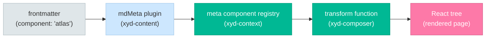
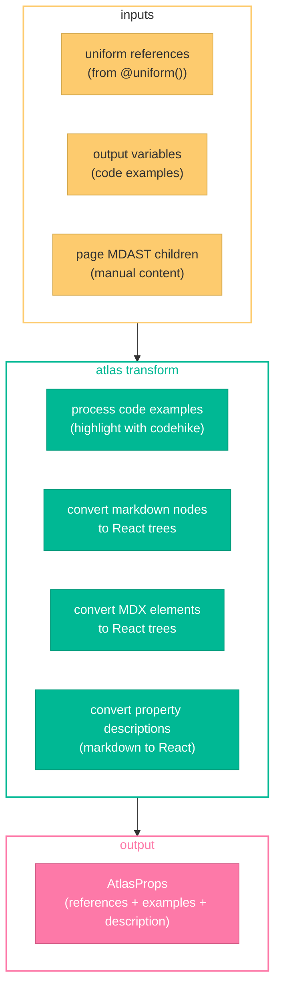

# Composer

The Composer (`xyd-composer`) is a server-side content composition engine that combines auto-generated API documentation with manually written content. It transforms Markdown AST, MDX elements, and Uniform data into React trees at build time.

## How It Works



The composition flow:

1. **Frontmatter triggers composition** — a page with `component: "atlas"` (or `uniform:`, `openapi:`, `graphql:`) in frontmatter activates the composer
2. **`mdMeta` plugin resolves props** — the remark plugin in `xyd-content` parses frontmatter, resolves `@uniform()` function calls to fetch API references, and looks up the registered meta component
3. **Meta component registry** — `xyd-context` maintains a global registry (`globalThis.__xydCtxMetaRegistry`) where meta components are registered by name
4. **Transform function runs** — the composer's transform function receives theme settings, resolved props, output variables (code examples), the page's MDAST children, and metadata
5. **React tree output** — the transform produces component props that `mdMeta` wraps in a component-like AST node, replacing the page's content tree

## Registration

The `Composer` class is instantiated in `xyd-plugin-docs`'s layout loader:

```typescript
new Composer() // registered via decorators on instantiation
```

Each method in the `Composer` class uses the `@metaComponent` decorator to register itself in the global registry:

```typescript
@metaComponent("atlas", "Atlas")
private async atlasMetaComponent(...) { ... }
```

The decorator calls `registerMetaComponent(name, componentName, transform)` from `xyd-context`, which stores the transform function in `globalThis.__xydCtxMetaRegistry`.

## Meta Components

| Meta Component | Decorator Name | Output Component | Purpose |
|---|---|---|---|
| `atlasMetaComponent` | `"atlas"` | `Atlas` | API reference pages — processes Uniform references, code examples, markdown descriptions |
| `homeMetaComponent` | `"home"` | `PageHome` | Landing pages — sets `layout: "page"` |
| `blogHomeMetaComponent` | `"bloghome"` | `PageBlogHome` | Blog listing pages — sets `layout: "page"` |
| `firstSlideMetaComponent` | `"firstslide"` | `PageFirstSlide` | Hero/slide pages — sets `layout: "page"`, compiles `rightContent` via MDX |

## Atlas Meta Component (API Pages)

The `atlas` meta component is the most complex — it handles composing API documentation:



What the atlas transform does:

1. **Code examples** — processes output variables (`vars.examples`) into `ExampleRoot` format with syntax highlighting via CodeHike
2. **Manual content merging** — walks the page's MDAST children:
   - Standard markdown nodes (paragraphs, lists, etc.) are converted to HTML → JSX → React elements
   - `h1` headings override the reference title
   - MDX elements (`mdxJsxFlowElement`) are serialized to JSX strings → parsed with Babel → converted to React elements
3. **Description composition** — markdown string descriptions in references are converted to React trees
4. **Property descriptions** — recursively processes all `DefinitionProperty` descriptions, converting markdown to React trees (only when the text contains non-plain-text markdown tokens)
5. **Example fallback** — if no output variable examples exist but the reference has examples (from OpenAPI), those are highlighted instead

## Transform Function Signature

Each meta component transform receives:

| Parameter | Type | Description |
|---|---|---|
| `themeSettings` | `Theme` | Theme configuration (used for syntax highlight theme) |
| `props` | `any` | Resolved component props (e.g., `AtlasProps` with references) |
| `vars` | `AtlasVars` | Output variables from the page (e.g., code blocks) |
| `treeChilds` | `readonly RootContent[]` | Frozen MDAST children of the page |
| `meta` | `Metadata` | Page frontmatter metadata |
| `settings` | `Settings` | Full application settings (optional, used by `firstslide`) |

## Internal Utilities

| Function | Purpose |
|---|---|
| `jsxStringToReactTree()` | Parses JSX string with Babel, finds first JSX node, builds React element tree |
| `buildElement()` | Recursively converts Babel JSX AST nodes to `React.createElement` calls |
| `processDefinitionProperties()` | Recursively converts markdown descriptions in definitions/variants to React trees |
| `isMarkdownText()` | Detects if a string contains markdown formatting (not just plain text) using `marked.lexer` |
| `mdxExport()` | Executes compiled MDX function body string with JSX runtime scope |

## User-Facing: Compose Content

From a user perspective, composition is triggered by frontmatter in markdown files:

```yaml
---
title: My API Endpoint
uniform: "./api/openapi.yaml"
---

### Additional Notes

This content is **composed** with the auto-generated API documentation above.
```

The `uniform` field triggers the atlas meta component. Content below the frontmatter is merged into the reference description as composed content. Users can also use `openapi:` or `graphql:` as aliases for `uniform:`.