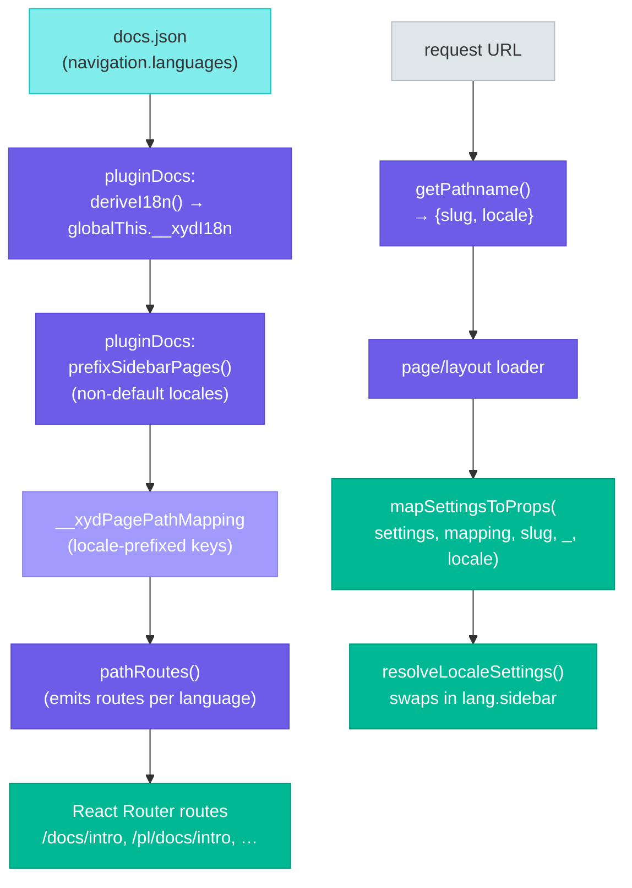
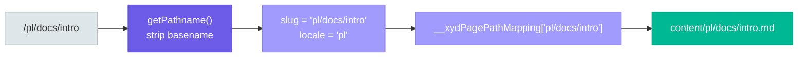

# Internationalization (i18n)

This page documents the i18n layer in xyd: how multi-language docs are configured in `docs.json`, how routes/files are organized, and how the framework wires it all up at runtime.

> **Status:** V1. Routing, per-locale navigation, and per-locale content all work. SEO (`hreflang`, `<html lang>`), the locale switcher, search-locale filtering, prehydration script, and the `"i18n: <key>"` translation-key resolver are tracked as follow-up slices — see "Future work" at the bottom.

## Overview

xyd's i18n is configured via a single source of truth: `navigation.languages[]`. Each entry is a per-locale navigation block (sidebar/tabs/anchors) plus locale fields (`language`, `name`, `default`, `dir`, `overrides`).

The default locale's content lives at the content root and is served unprefixed (`/docs/intro`). Other locales mirror that tree under `<language>/` and are served at `/<language>/<slug>` (e.g. `/pl/docs/intro`).

Missing translations 404 — there is no fallback to the default locale.

## Architecture



### Key insight: pre-prefixing

The framework's "trick" for keeping the rest of the stack locale-unaware is **pre-prefixing**. At boot, `pluginDocs` walks each non-default-locale entry's `sidebar` and prepends the locale code to every page string and `SidebarRoute.route`:

```ts
// Before (user wrote):
{ language: "pl", sidebar: ["docs/intro", { route: "/api", pages: [/*…*/] }] }

// After prefixSidebarPages():
{ language: "pl", sidebar: ["pl/docs/intro", { route: "/pl/api", pages: [/*…*/] }] }
```

This makes URL slugs, sidebar pages, and `__xydPagePathMapping` keys all share **one key space**. Downstream code (`mapSettingsToProps`, `pathRoutes`, `docPaths`) just walks the prefixed sidebar and gets correct results without any locale-aware lookups.

### Derived globals: `__xydI18n`

At `appInit()`, `pluginDocs` derives and caches:

```ts
globalThis.__xydI18n = {
  defaultLocale: string,                       // i18n.defaultLocale ?? languages.find(l => l.default)?.language ?? languages[0].language
  locales: string[],                           // languages.map(l => l.language)
  byLocale: Record<string, LanguageNavigation>,// keyed lookup
  detectLanguage: boolean                      // i18n.detectLanguage ?? false
}
```

Read by routing, the page/layout loaders, `docPaths`, and (in future slices) sitemap/prehydration/search.

### URL → slug → file



`getPathname()` (in `packages/xyd-plugin-docs/src/pages/page.tsx` and `layout.tsx`) returns `{ slug, locale }`. The slug already contains the locale prefix when serving a non-default locale (because the sidebar was pre-prefixed and routes were emitted accordingly), so the mapping lookup is a direct dictionary hit. The separate `locale` is passed to `mapSettingsToProps` so it can resolve the right per-language navigation tree.

### `resolveLocaleSettings` in mapSettingsToProps

```ts
function resolveLocaleSettings(settings: Settings, locale?: string): Settings {
  const langs = settings?.navigation?.languages
  if (!locale || !langs?.length) return settings
  const entry = langs.find(l => l.language === locale)
  if (!entry) return settings
  return {
    ...settings,
    navigation: {
      ...settings.navigation,
      sidebar: entry.sidebar,
      tabs: entry.tabs,
      // … etc
    }
  }
}
```

This is the only locale-aware step inside `mapSettingsToProps`. Everything downstream (sidebar groups, breadcrumbs, prev/next nav links) operates on `settings.navigation.sidebar` as if there were no i18n.

### Prerender list (`docPaths`)

`xyd-host/app/docPaths.ts` collects the list of routes to prerender (used by `react-router.config.ts` with `ssr: false`). In i18n mode it walks every language's sidebar and returns the locale-prefixed paths. With React Router 7's stricter `ssr:false` validator, every route that exports a `loader` must be in the prerender list, so this step is load-bearing.

## Configuration

### Minimal form

```json
{
  "theme": { "name": "cosmo" },
  "navigation": {
    "languages": [
      {
        "language": "en",
        "name": "English",
        "default": true,
        "sidebar": ["docs/intro"]
      },
      { "language": "pl", "name": "Polski",  "sidebar": ["docs/intro"] },
      { "language": "de", "name": "Deutsch", "sidebar": ["docs/intro"] }
    ]
  }
}
```

### Optional `i18n` block

A top-level `i18n` block is optional and carries site-wide flags that don't belong on a single locale entry:

```json
{
  "i18n": {
    "defaultLocale": "en",
    "detectLanguage": true
  },
  "navigation": { "languages": [/* … */] }
}
```

When the `i18n` block is present, it wins:

- `i18n.defaultLocale` overrides any `default: true` shorthand on language entries.
- `i18n.detectLanguage` — reserved for the prehydration redirect (future slice; currently unused at runtime).
- `i18n.translations` — reserved for translation catalogs used by the `"i18n: <key>"` resolver (future slice).

For the full field reference, see the `Settings`, `Navigation`, `LanguageNavigation`, and `I18nConfig` interfaces in `4.settings/1.SETTINGS.md` (and the source of truth: `packages/xyd-core/src/types/settings.ts`).

## File structure

```
content/
├── docs/intro.md              # default locale (en)
├── docs/api.md
├── pl/
│   └── docs/intro.md          # Polish translation
└── de/
    └── docs/intro.md          # German translation
```

- The default locale's content lives at the content root, matching its unprefixed URL.
- Each non-default locale is a mirror subtree under `<language>/`.
- Frontmatter is translated **per file**: each locale's `.md` owns its own `title`, `description`, etc.
- Untranslated pages are simply absent on disk → 404 at request time.

## Affected files

| Concern | File |
|---|---|
| Settings types | `packages/xyd-core/src/types/settings.ts` |
| i18n derivation, sidebar pre-prefixing, path mapping | `packages/xyd-plugin-docs/src/index.ts` |
| Page loader (slug + locale extraction) | `packages/xyd-plugin-docs/src/pages/page.tsx` |
| Layout loader | `packages/xyd-plugin-docs/src/pages/layout.tsx` |
| Route generation | `packages/xyd-host/app/pathRoutes.ts` |
| Prerender list | `packages/xyd-host/app/docPaths.ts` |
| Sidebar / breadcrumbs / navlinks per locale | `packages/xyd-framework/packages/hydration/mapSettingsToProps.ts` |

## Future work

Tracked under follow-up slices, not in V1:

- **SEO**: `<html lang>`, `<link rel="alternate" hreflang="…">`, sitemap `xhtml:link` alternates, per-locale `llms.txt`.
- **Locale switcher**: `FwLocaleSwitcher` component + Surface registration on `nav.right`.
- **Prehydration script**: sets `<html lang>` synchronously before React hydration; honors `i18n.detectLanguage`.
- **Translation key resolver**: `"i18n: footer.resources.header"` strings in component config, resolved at render time from per-locale catalogs declared in `i18n.translations`.
- **Search localization**: tag indexed docs with locale, filter by current locale.
- **Per-locale OpenAPI / GraphQL specs**: V2.
