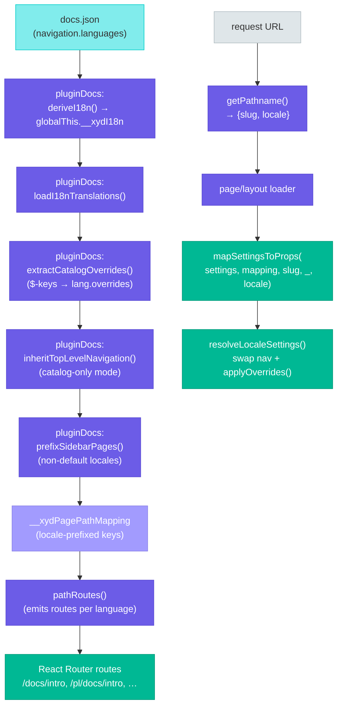
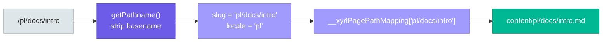

# Internationalization (i18n)

This page documents the i18n feature - a multi-language docs are configured in `docs.json`, how routes/files are organized, and how the framework wires it all up at runtime.

> **Status:** V1. Routing, per-locale navigation, per-locale content, the `FwLocaleSwitcher` component (auto-registered on the `nav.right` surface), the `"i18n: <key>"` translation-key resolver, catalog-only navigation (top-level nav inherited when language entry omits `sidebar`/`tabs`/etc.), and per-locale settings overrides — both via `navigation.languages[].overrides` and via catalog `$`-prefixed keys — all work. SEO (`hreflang`, `<html lang>`), search-locale filtering, and the prehydration script are tracked as follow-up slices — see "Future work" at the bottom.

## Overview

xyd's i18n is configured via a single source of truth: `navigation.languages[]`. Each entry is a per-locale navigation block (sidebar/tabs/anchors) plus locale fields (`language`, `name`, `default`, `dir`, `overrides`).

The default locale's content lives at the content root and is served unprefixed (`/docs/intro`). Other locales mirror that tree under `<language>/` and are served at `/<language>/<slug>` (e.g. `/pl/docs/intro`).

Missing translations 404 — there is no fallback to the default locale.

## Architecture



### Key insight: pre-prefixing

The framework's "trick" for keeping the rest of the stack locale-unaware is **pre-prefixing**. At boot, `pluginDocs` walks each non-default-locale entry's `sidebar` and prepends the locale code to every page string and `SidebarRoute.route`:

```ts
// Before (user wrote):
{ language: "pl", sidebar: ["docs/intro", { route: "/api", pages: [/*…*/] }] }

// After prefixSidebarPages():
{ language: "pl", sidebar: ["pl/docs/intro", { route: "/pl/api", pages: [/*…*/] }] }
```

This makes URL slugs, sidebar pages, and `__xydPagePathMapping` keys all share **one key space**. Downstream code (`mapSettingsToProps`, `pathRoutes`, `docPaths`) just walks the prefixed sidebar and gets correct results without any locale-aware lookups.

### Derived globals: `__xydI18n`

At `appInit()`, `pluginDocs` derives and caches:

```ts
globalThis.__xydI18n = {
  defaultLocale: string,                       // i18n.defaultLocale ?? languages.find(l => l.default)?.language ?? languages[0].language
  locales: string[],                           // languages.map(l => l.language)
  byLocale: Record<string, LanguageNavigation>,// keyed lookup
  detectLanguage: boolean                      // i18n.detectLanguage ?? false
}
```

Read by routing, the page/layout loaders, `docPaths`, and (in future slices) sitemap/prehydration/search.

### URL → slug → file



`getPathname()` (in `packages/xyd-plugin-docs/src/pages/page.tsx` and `layout.tsx`) returns `{ slug, locale }`. The slug already contains the locale prefix when serving a non-default locale (because the sidebar was pre-prefixed and routes were emitted accordingly), so the mapping lookup is a direct dictionary hit. The separate `locale` is passed to `mapSettingsToProps` so it can resolve the right per-language navigation tree.

### `inheritTopLevelNavigation` (catalog-only mode)

If a language entry omits `sidebar`/`tabs`/`sidebarDropdown`/`segments`/`anchors`, it inherits the matching field from the top-level `navigation`. This lets users write the structure once at `navigation.sidebar` and only declare locales — translations come from catalogs (see below).

```ts
// User wrote:
{ navigation: { languages: [{language:"en",default:true},{language:"pl"}],
                sidebar: [{group:"i18n: x", pages:["intro"]}] } }

// After inheritTopLevelNavigation():
// each language entry gets a deep-cloned copy of the top-level sidebar,
// so the prefixSidebarPages() pass below mutates per-locale copies safely.
```

Implemented in `pluginDocs` as `inheritTopLevelNavigation(settings)`, called once before `prefixSidebarPages` runs.

### `extractCatalogOverrides` (catalog `$`-keys)

Catalog keys prefixed with `$` are not translation keys — they encode per-locale settings overrides applied to the matching language entry's `overrides`:

```json
// pl.json
{
  "sidebar.greet": "Cześć",
  "$components.footer.footnote.props.children": "Wspierane przez LiveSession",
  "$components.footer.footnote.props.href": "https://pl.livesession.io"
}
```

At boot, `pluginDocs` calls `extractCatalogOverrides(catalogs)` which:

1. Pulls out every `$`-prefixed key from each catalog and strips the prefix.
2. Mutates the catalogs to drop the `$` keys (so `"i18n: <key>"` lookup never sees them).
3. Returns a per-locale flat-key overrides map.

The map is then merged into `navigation.languages[].overrides` so the runtime `resolveLocaleSettings` deep-merges it like any declared override.

### `resolveLocaleSettings` + `applyOverrides`

```ts
function resolveLocaleSettings(settings: Settings, locale?: string): Settings {
  const langs = settings?.navigation?.languages
  if (!locale || !langs?.length) return settings
  const entry = langs.find(l => l.language === locale)
  if (!entry) return settings

  const next: Settings = {
    ...settings,
    navigation: {
      ...settings.navigation,
      sidebar: entry.sidebar,
      tabs: entry.tabs,
      sidebarDropdown: entry.sidebarDropdown,
      segments: entry.segments,
      anchors: entry.anchors,
    }
  }

  if (entry.overrides) {
    return applyOverrides(next, entry.overrides)
  }
  return next
}
```

`applyOverrides` deep-merges the override block into the resolved settings. It supports both shapes:

- **Nested objects** — standard `Partial<Settings>` (`{components: {footer: {…}}}`).
- **Flat dot-keys** — `{"components.footer.footnote.props.children": "Wspierane"}`. Expanded to nested form before merge so a single override path doesn't have to declare four levels of object literal.

Two helpers do the work: `expandDotKeys()` walks the override map and turns dot-keys into nested objects; `mergeDeep()` merges source into target without mutating either side. JSON cloning protects the result from later mutation.

This is the only locale-aware step inside `mapSettingsToProps`. Everything downstream (sidebar groups, breadcrumbs, prev/next nav links) operates on `settings.navigation.sidebar` as if there were no i18n.

### Prerender list (`docPaths`)

`xyd-host/app/docPaths.ts` collects the list of routes to prerender (used by `react-router.config.ts` with `ssr: false`). In i18n mode it walks every language's sidebar and returns the locale-prefixed paths. With React Router 7's stricter `ssr:false` validator, every route that exports a `loader` must be in the prerender list, so this step is load-bearing.

## Configuration

### Minimal form

```json
{
  "theme": { "name": "cosmo" },
  "navigation": {
    "languages": [
      {
        "language": "en",
        "name": "English",
        "default": true,
        "sidebar": ["docs/intro"]
      },
      { "language": "pl", "name": "Polski",  "sidebar": ["docs/intro"] },
      { "language": "de", "name": "Deutsch", "sidebar": ["docs/intro"] }
    ]
  }
}
```

### Optional `i18n` block

A top-level `i18n` block is optional and carries site-wide flags that don't belong on a single locale entry:

```json
{
  "i18n": {
    "defaultLocale": "en",
    "detectLanguage": true
  },
  "navigation": { "languages": [/* … */] }
}
```

When the `i18n` block is present, it wins:

- `i18n.defaultLocale` overrides any `default: true` shorthand on language entries.
- `i18n.detectLanguage` — reserved for the prehydration redirect (future slice; currently unused at runtime).
- `i18n.catalogs` — translation catalogs used by the `"i18n: <key>"` resolver. See [Translation catalogs](#translation-catalogs) below.

### Translation catalogs

Any string in the navigation tree (and any value passed through `useT()` from a theme) can be written as `"i18n: <key>"`. At request time the framework looks the key up in the current-locale catalog (then the default-locale catalog, then falls back to the literal key for visibility in dev). Catalogs accept both flat dot-keys and nested objects in the same file.

There are three ways to register catalogs, in priority order:

**1. Custom file paths** — relative to project root or absolute:

```json
{
  "i18n": {
    "catalogs": {
      "en": "./locales/english.json",
      "pl": "./tlumaczenia/polski.json",
      "de": "./locales/de-DE.json"
    }
  }
}
```

**2. Inline catalogs** — useful for small projects:

```json
{
  "i18n": {
    "catalogs": {
      "en": { "footer.copyright": "All rights reserved" },
      "pl": { "footer": { "copyright": "Wszelkie prawa zastrzeżone" } }
    }
  }
}
```

**3. Convention fallback** — when `i18n.catalogs` is omitted (or a particular locale's entry is missing), the framework auto-discovers `i18n/<language>.json` at the project root.

#### Catalog file format

Two equivalent shapes; both can coexist in the same file:

```json
// Flat dot-keys
{ "footer.resources.header": "Resources", "footer.resources.examples": "Examples" }

// Or nested objects
{ "footer": { "resources": { "header": "Resources", "examples": "Examples" } } }
```

Lookup tries the exact flat key first, then walks dot-segments through nested objects.

For the full field reference, see the `Settings`, `Navigation`, `LanguageNavigation`, and `I18nConfig` interfaces in `4.settings/1.SETTINGS.md` (and the source of truth: `packages/xyd-core/src/types/settings.ts`).

### Per-locale overrides

Each `navigation.languages[]` entry accepts `overrides?: Partial<Settings>` for any field that should differ per locale (e.g. translated footer link text, banner content, locale-specific component config). Two equivalent shapes are accepted:

```jsonc
// Flat dot-key (recommended for narrow overrides)
{ "language": "pl",
  "overrides": { "components.footer.footnote.props.children": "Wspierane" } }

// Nested Partial<Settings>
{ "language": "pl",
  "overrides": { "components": { "footer": { "footnote": { "props": { "children": "Wspierane" } } } } } }
```

Overrides come from two sources, both ending up on the same `lang.overrides` field:

1. **Declared in `docs.json`** under `navigation.languages[].overrides`.
2. **Extracted from catalog `$`-keys** at boot — e.g. `"$components.footer.footnote.props.children"` in `pl.json` becomes `lang.overrides["components.footer.footnote.props.children"]`. See `extractCatalogOverrides` above.

At request time `resolveLocaleSettings` deep-merges `lang.overrides` into the effective settings. Flat dot-keys are expanded to nested form before the merge.

## File structure

```
content/
├── docs/intro.md              # default locale (en)
├── docs/api.md
├── pl/
│   └── docs/intro.md          # Polish translation
└── de/
    └── docs/intro.md          # German translation
```

- The default locale's content lives at the content root, matching its unprefixed URL.
- Each non-default locale is a mirror subtree under `<language>/`.
- Frontmatter is translated **per file**: each locale's `.md` owns its own `title`, `description`, etc.
- Untranslated pages are simply absent on disk → 404 at request time.

## Affected files

| Concern | File / symbol |
|---|---|
| Settings types (`I18nConfig`, `LanguageNavigation.overrides`, `TranslationCatalog`) | `packages/xyd-core/src/types/settings.ts` |
| i18n derivation, catalog loading, sidebar pre-prefixing, path mapping | `packages/xyd-plugin-docs/src/index.ts` |
| Catalog-only mode helper (`inheritTopLevelNavigation`) | `packages/xyd-plugin-docs/src/index.ts` |
| Catalog `$`-key extractor (`extractCatalogOverrides`) | `packages/xyd-plugin-docs/src/index.ts` |
| Page loader (slug + locale extraction) | `packages/xyd-plugin-docs/src/pages/page.tsx` |
| Layout loader | `packages/xyd-plugin-docs/src/pages/layout.tsx` |
| Route generation | `packages/xyd-host/app/pathRoutes.ts` |
| Prerender list | `packages/xyd-host/app/docPaths.ts` |
| Sidebar / breadcrumbs / navlinks per locale, override merge (`applyOverrides`, `expandDotKeys`, `mergeDeep`) | `packages/xyd-framework/packages/hydration/mapSettingsToProps.ts` |
| Unit tests | `packages/xyd-plugin-docs/__tests__/i18n.{loadTranslations,inheritTopLevelNavigation,extractCatalogOverrides}.test.ts` |

## Future work

Tracked under follow-up slices, not in V1:

- **SEO**: `<html lang>`, `<link rel="alternate" hreflang="…">`, sitemap `xhtml:link` alternates, per-locale `llms.txt`.
- **Prehydration script**: sets `<html lang>` synchronously before React hydration; honors `i18n.detectLanguage`.
- **Search localization**: tag indexed docs with locale, filter by current locale.
- **Per-locale OpenAPI / GraphQL specs**: V2.
