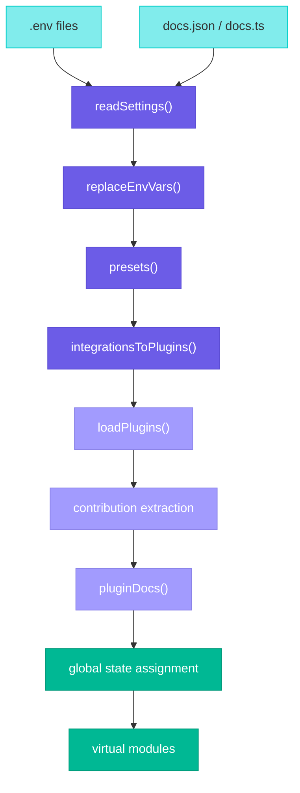
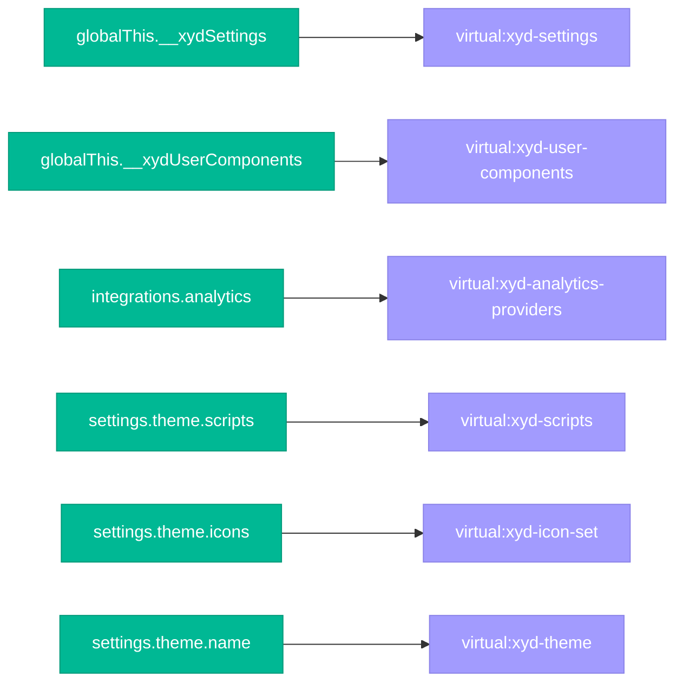

# Configuration System

The Configuration System manages how `docs.json` is loaded, processed, transformed into plugins and global state, and made available at runtime via virtual modules. This document covers the internal pipeline — for the settings schema reference, see `4.settings/SettingsSchemaAndDocsJson.md`.

## Processing Pipeline

### Step by step

1. **Environment loading** — `loadEnvFiles()` loads `.env`, `.env.local`, `.env.development`, `.env.production` in order using `dotenv` with `override: true`
2. **File discovery** — `readSettings()` searches for `docs.{tsx,ts,json}` in the working directory. TypeScript files are evaluated via Vite's `ssrLoadModule`, JSON files parsed with `JSON.parse`
3. **Environment variable substitution** — `replaceEnvVars()` traverses the settings object and replaces `$VAR_NAME` strings with values from `process.env`
4. **Presets** — normalizes settings with defaults:
   - Loads syntax highlight theme JSON if specified as string
   - Ensures `navigation.sidebar` exists (default empty array)
   - Initializes `theme.head` array
   - Prefixes logo/favicon paths with `advanced.basename`
   - Converts `integrations.diagrams: true` to `["mermaid"]`
5. **Integration conversion** — `integrationsToPlugins()` transforms `integrations` config (analytics, search, support, diagrams) into plugin format before explicit plugin loading
6. **Plugin loading** — `loadPlugins()` resolves plugin packages from `settings.plugins` array (npm packages and local paths)
7. **Contribution extraction** — each plugin's `PluginConfig` is processed to collect:
   - Vite plugins → added to Vite build config
   - Uniform processors → `globalThis.__xydUserUniformVitePlugins`
   - Markdown plugins → `globalThis.__xydUserMarkdownPlugins`
   - Components → `globalThis.__xydUserComponents` (with dist path resolution)
   - Hooks → `globalThis.__xydUserHooks`
   - Head elements → merged into `settings.theme.head`
8. **Plugin docs processing** — `pluginDocs()` generates routes, navigation structure, and page path mappings from the processed settings
9. **Global state assignment** — final settings and all collected contributions are stored on `globalThis`
10. **Virtual modules** — Vite plugins generate importable modules from the global state

## Component Resolution

Plugin components undergo special processing during contribution extraction:

1. **Name resolution** — if no `name` specified, uses `component.name` (function name)
2. **Dist path resolution** — if no `dist` specified, constructs path from plugin package location + component name
3. **Existence check** — checks if dist file exists with `.js`, `.ts`, `.tsx` extensions
4. **Inline flag** — sets `isInline: true` if dist path doesn't exist (component function is serialized directly into the virtual module)

## Global State

After processing, settings and plugin contributions are stored on `globalThis` for access across the application:

| Variable | Type | Purpose |
|---|---|---|
| `__xydSettings` | `Settings` | Complete processed settings object |
| `__xydSettingsClone` | `Settings` | Immutable JSON clone for change detection |
| `__xydBasePath` | `string` | Base path for routing (from `advanced.basename`) |
| `__xydPagePathMapping` | `Record<string, string>` | Maps page routes to file system paths |
| `__xydUserComponents` | `ComponentPlugin[]` | Components contributed by plugins |
| `__xydUserComponentsSERVER` | `ComponentPlugin[]` | Server-side clone of components |
| `__xydUserMarkdownPlugins` | `MarkdownPlugins` | Remark/Rehype plugins from plugins |
| `__xydUserHooks` | `Record<string, Function[]>` | Lifecycle hooks from plugins |
| `__xydUserUniformVitePlugins` | `UniformPlugin[]` | API spec processors from plugins |
| `__xydRawRouteFiles` | `Record<string, string>` | Raw file contents for llms.txt |
| `__xydAccessMap` | `Record<string, string>` | Page access levels (if access control configured) |

## Virtual Modules

Virtual modules are Vite plugins that generate importable modules from global state. They are defined in `xyd-documan` and `xyd-plugin-docs`:

| Virtual Module | Defined In | Source | Purpose |
|---|---|---|---|
| `virtual:xyd-settings` | xyd-documan | `__xydSettings` | Exports settings, settingsClone, userPreferences, userHooks |
| `virtual:xyd-user-components` | xyd-documan | `__xydUserComponentsSERVER` | Bundles plugin components (import or inline) |
| `virtual:xyd-analytics-providers` | xyd-documan | `integrations.analytics` | Dynamic provider loaders |
| `virtual:xyd-scripts` | xyd-documan | `theme.scripts` | Side-effect script imports |
| `virtual:xyd-icon-set` | xyd-documan | `theme.icons` | Icon library config for Iconify |
| `virtual:xyd-theme-presets` | xyd-documan | `theme.appearance.presets` | CSS preset file URLs |
| `virtual:xyd-theme` | xyd-plugin-docs | `theme.name` | Instantiated theme class |
| `virtual:xyd-theme/index.css` | xyd-plugin-docs | theme package | Theme stylesheet |
| `virtual:xyd-theme-override/index.css` | xyd-plugin-docs | `generateUserCss()` | User appearance overrides as CSS |

## Hot Reloading

During development, the configuration system watches files and triggers appropriate reload strategies:

| Change Type | Strategy | Reason |
|---|---|---|
| Settings file (`docs.json`) | Full or incremental | Depends on which properties changed |
| Content file (edit) | HMR | Only content changed |
| Content file (rename) | Full reload | Routing structure changed |
| API spec file | Full reload | May affect navigation and references |
| Icon file | Module invalidation | Invalidate `virtual:xyd-icon-set` |
| Environment file | Server restart | Affects settings processing from the start |
| Public directory | Full reload | Static assets changed |

**Full restart triggers**: changes to `theme.name` or `plugins` require complete server restart because they affect plugin loading and theme resolution.

The `__xydSettingsClone` is compared against the current settings to detect which properties changed and determine the minimal reload strategy.