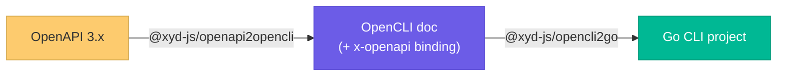

# OpenCLI {label="Experimental"}
:::subtitle
Generate a real, working CLI from your OpenAPI spec
:::

`OpenCLI` turns an [OpenAPI](https://www.openapis.org) description into a **functional
command-line interface** — not just a stub. The generated CLI makes real HTTP requests
against your API, with commands, arguments, flags, and authentication derived from the spec.

The conversion runs in composable stages, so each step is independently usable and testable:



| Stage | Package | Input → Output |
|-------|---------|----------------|
| Surface | `@xyd-js/openapi2opencli` | OpenAPI 3.x → OpenCLI document |
| Generator | `@xyd-js/opencli2go` | OpenCLI document → Go CLI project |

## OpenCLI, the intermediate format

[OpenCLI](https://opencli.org) is an open specification that describes a CLI's *surface* —
its command tree, arguments, and options. xyd uses it as the neutral hand-off between the
spec and the language generators, so the same OpenCLI document can target Go today and other
languages later.

A typical mapping from OpenAPI to the OpenCLI command tree:

| OpenAPI | OpenCLI |
|---------|---------|
| static path segment (`/chat/completions`) | command tree (`chat completions …`) |
| `{path_param}` | positional **argument** |
| method + path shape | leaf action (`list`, `create`, `retrieve`, `update`, `delete`, …) |
| `query` parameter | **option** (flag) |
| request body property | **option** (flag) |

## Functional, not just structural

A surface alone can't make requests. To generate a CLI that actually *calls* the API, the
OpenCLI document carries an **`x-openapi`** extension that binds each command back to the
HTTP request it represents:

- **Root** — base server URLs and the security scheme (e.g. a `Bearer` token read from an
  environment variable like `OPENAI_API_KEY`).
- **Per command** — the HTTP `method` and `path`, plus how each argument/option maps into
  the request (path substitution, query string, or JSON body).

This binding is what lets `@xyd-js/opencli2go` emit handlers that assemble and send the real
request.

## Library usage

The pipeline is available as plain functions, so you can wire it into your own scripts or
build step:

```ts generate-cli.ts
import { openapi2opencliFromSource } from "@xyd-js/openapi2opencli"
import { opencli2go, writeProject } from "@xyd-js/opencli2go"

// 1. OpenAPI → OpenCLI (carries the x-openapi request binding)
const opencli = await openapi2opencliFromSource("./openapi.yaml", {
    cliName: "petstore",
})

// 2. OpenCLI → a Go CLI project (a virtual file map: path → contents)
const files = opencli2go(opencli)

// 3. Write the project to disk
await writeProject(files, "./petstore-cli")
```

Then build and run the generated CLI:

```bash
cd petstore-cli
go build ./cmd/petstore

export PETSTORE_API_KEY="..."
./petstore pets list --limit 10
./petstore pets create --name "Rex"
```

If you already have a dereferenced OpenAPI document in memory, use the synchronous
`openapi2opencli(doc, options)` instead of the `…FromSource` convenience.

## Validated against OpenAI

The generator is conformance-tested against a real-world surface: the
[OpenAI OpenAPI spec](https://github.com/openai/openai-openapi) and its official
[`openai-cli`](https://github.com/openai/openai-cli). An end-to-end suite assembles the whole
CLI (200+ commands), runs each command against a recording server, and checks the actual HTTP
request — method, path, query, body, and auth — against committed fixtures.

:::callout
More language generators (e.g. Python and TypeScript) are planned. They reuse the same
OpenCLI document and `x-openapi` binding, so no extra work in the surface stage is needed.
:::
